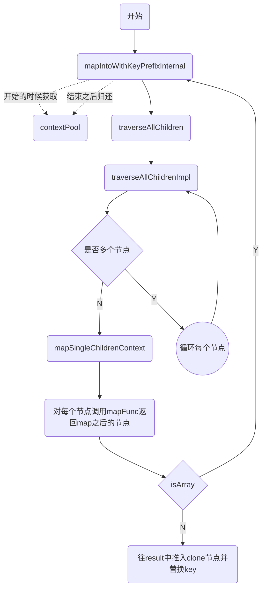

知其然知其所以然，框架工的自我尝试进阶

## React源码浅析

知识点：

**React Api**

`createElement`、`createContext`、`JSX=>JS`、`ConcurrentMode`、`Ref`、`Component`、`Suspense`、`Hooks`

**React 中的更新创建**

`ReactDOM.render`、`Fiber`、`UpdateQueue`、`FiberRoot`、`Update`、`expirationTime`

**Fiber Scheduler**

`scheduleWork`、`batchedUpdates`、`performWork`、`performUnitOfWork`、`requestWork`、`react scheduler`、`renderRoot`

**开始更新**

`beginWork以及优化`、`各类组件的更新过程`、`调节子节点的过程`

**完成各个节点的更新**

`completeUnitOfWork`、`虚拟DOM对比`、`completeWork`、`错误捕获处理`、`unwindwork`、`完成整棵树更新`

**提交更新**

`commitRoot整体流程`、`开发时的帮助方法`、`提交快照`、`提交DOM插入`、`提交DOM更新`、`提交DOM删除`、`提交所有生命周期`

**各功能的实现功能**

`context的实现过程`、`ref的实现过程`、`hydrate的实现过程`、`React的事件体系`

**Suspense**

`更新优先级的概念`、`更新挂起的概念`、`Suspense组件更新`、`timeout处理`、`retry重新尝试渲染`、`lazy组件更新`

**Hooks**

`核心原理`、`useState`、`useEffect`、`useContent`、`其他Hooks API`

### React Api 相关

#### React.js

```react
const React = {
    Children:{
        map,
        forEach,
        count,
        toArray,
        only
    },
    createRef,
    Component,
    PureComponent,
    createContext,
    forWardRef,
    lazy,
    memo,
    Fragment:REACT_FRAGMENT_TYPE,
    StrictMode:REACT_STRICT_MODE_TYPE,
    SuspenseLREACT_SUSPENSE_TYPE,
    createElement:__DEV__?createElementWithValidation:createElement,
    cloneElement:__DEV__?cloneElementWithValidation:cloneElement,
    isValidElement:isValidElement,
    version:ReactVersion,
    __SECRET_INTERNALS_DO_NOT_USE_OR_YOU_WILL_BE_FIRED:ReactSharedInternals,
}
if (enableStableConcurrentModeAPIs) {
  React.ConcurrentMode = REACT_CONCURRENT_MODE_TYPE;
  React.Profiler = REACT_PROFILER_TYPE;
} else {
  React.unstable_ConcurrentMode = REACT_CONCURRENT_MODE_TYPE;
  React.unstable_Profiler = REACT_PROFILER_TYPE;
}

export default React;
```


#### ReactElement.js

```react
// hasOwnProperty 方法返回一个布尔值，指示对象自身属性中是否具有指定的属性（也就是知否有指定的键）
const hasOwnProperty = Object.prototype.hasOwnProperty;
// 内建的props
const RESERVED_PROPS = {
  key: true,
  ref: true,
  __self: true,
  __source: true,
};

let specialPropKeyWarningShown, specialPropRefWarningShown;
// 判断是否是合法的 ref
function hasValidRef(config) {
  if (__DEV__) {
    if (hasOwnProperty.call(config, 'ref')) {
      /**
      * getOwnPropertyDescriptor 返回指定对象上自有属性描述符（自有属性指的是直接赋予该对象的属性，不需要从原型链上进行查找的属性）
      * get 方法。获取该属性的访问器函数（getter）。如果没有访问器，该值为 undefined
      */
      const getter = Object.getOwnPropertyDescriptor(config, 'ref').get;
      if (getter && getter.isReactWarning) {
        return false;
      }
    }
  }
  return config.ref !== undefined;
}
// 判断是否是合法的 key
function hasValidKey(config) {
  if (__DEV__) {
    if (hasOwnProperty.call(config, 'key')) {
      const getter = Object.getOwnPropertyDescriptor(config, 'key').get;
      if (getter && getter.isReactWarning) {
        return false;
      }
    }
  }
  return config.key !== undefined;
}
// 定义了 key 不合法抛出的警告
function defineKeyPropWarningGetter(props, displayName) {
  const warnAboutAccessingKey = function() {
    if (!specialPropKeyWarningShown) {
      specialPropKeyWarningShown = true;
      warningWithoutStack(
        false,
        '%s: `key` is not a prop. Trying to access it will result ' +
          'in `undefined` being returned. If you need to access the same ' +
          'value within the child component, you should pass it as a different ' +
          'prop. (https://fb.me/react-special-props)',
        displayName,
      );
    }
  };
  warnAboutAccessingKey.isReactWarning = true;
  Object.defineProperty(props, 'key', {
    get: warnAboutAccessingKey,
    configurable: true,
  });
}
// 定义了 ref 不合法抛出的警告
function defineRefPropWarningGetter(props, displayName) {
  const warnAboutAccessingRef = function() {
    if (!specialPropRefWarningShown) {
      specialPropRefWarningShown = true;
      warningWithoutStack(
        false,
        '%s: `ref` is not a prop. Trying to access it will result ' +
          'in `undefined` being returned. If you need to access the same ' +
          'value within the child component, you should pass it as a different ' +
          'prop. (https://fb.me/react-special-props)',
        displayName,
      );
    }
  };
  warnAboutAccessingRef.isReactWarning = true;
  Object.defineProperty(props, 'ref', {
    get: warnAboutAccessingRef,
    configurable: true,
  });
}

/**
 * Factory method to create a new React element. This no longer adheres to
 * the class pattern, so do not use new to call it. Also, no instanceof check
 * will work. Instead test $$typeof field against Symbol.for('react.element') to check
 * if something is a React Element.
 *
 * @param {*} type
 * @param {*} key
 * @param {string|object} ref
 * @param {*} self A *temporary* helper to detect places where `this` is
 * different from the `owner` when React.createElement is called, so that we
 * can warn. We want to get rid of owner and replace string `ref`s with arrow
 * functions, and as long as `this` and owner are the same, there will be no
 * change in behavior.
 * @param {*} source An annotation object (added by a transpiler or otherwise)
 * indicating filename, line number, and/or other information.
 * @param {*} owner
 * @param {*} props
 * @internal
 */
const ReactElement = function(type, key, ref, self, source, owner, props) {
  const element = {
    // This tag allows us to uniquely identify this as a React Element
    $$typeof: REACT_ELEMENT_TYPE,

    // Built-in properties that belong on the element
    type: type,
    key: key,
    ref: ref,
    props: props,

    // Record the component responsible for creating this element.
    _owner: owner,
  };
 // 开发环境的一些内容
  if (__DEV__) {
    // The validation flag is currently mutative. We put it on
    // an external backing store so that we can freeze the whole object.
    // This can be replaced with a WeakMap once they are implemented in
    // commonly used development environments.
    element._store = {};

    // To make comparing ReactElements easier for testing purposes, we make
    // the validation flag non-enumerable (where possible, which should
    // include every environment we run tests in), so the test framework
    // ignores it.
    Object.defineProperty(element._store, 'validated', {
      configurable: false,
      enumerable: false,
      writable: true,
      value: false,
    });
    // self and source are DEV only properties.
    Object.defineProperty(element, '_self', {
      configurable: false,
      enumerable: false,
      writable: false,
      value: self,
    });
    // Two elements created in two different places should be considered
    // equal for testing purposes and therefore we hide it from enumeration.
    Object.defineProperty(element, '_source', {
      configurable: false,
      enumerable: false,
      writable: false,
      value: source,
    });
    if (Object.freeze) {
      Object.freeze(element.props);
      Object.freeze(element);
    }
  }

  return element;
};

/**
 * 创建并返回给定类型的新ReactElement。
 * See https://reactjs.org/docs/react-api.html#createelement
 */
export function createElement(type, config, children) {
  let propName;

  // Reserved names are extracted
  const props = {};

  let key = null;
  let ref = null;
  let self = null;
  let source = null;

  if (config != null) {
    if (hasValidRef(config)) {
      ref = config.ref;
    }
    if (hasValidKey(config)) {
      key = '' + config.key;
    }

    self = config.__self === undefined ? null : config.__self;
    source = config.__source === undefined ? null : config.__source;
    // 如果不是内建的props以及本身拥有的属性，将剩余的属性传入到新的props对象中
    for (propName in config) {        
      if (
        hasOwnProperty.call(config, propName) &&
        !RESERVED_PROPS.hasOwnProperty(propName)
      ) {
        props[propName] = config[propName];
      }
    }
  }

  // 子对象可以是多个参数，并且这些参数会传输到新分配的props对象上。
  const childrenLength = arguments.length - 2;
  if (childrenLength === 1) {
    props.children = children;
  } else if (childrenLength > 1) {
    const childArray = Array(childrenLength);
    for (let i = 0; i < childrenLength; i++) {
      childArray[i] = arguments[i + 2];
    }
    if (__DEV__) {
      if (Object.freeze) {
        Object.freeze(childArray);
      }
    }
    props.children = childArray;
  }

  // 解析默认属性
  if (type && type.defaultProps) {
    const defaultProps = type.defaultProps;
    for (propName in defaultProps) {
      if (props[propName] === undefined) {
        props[propName] = defaultProps[propName];
      }
    }
  }
  if (__DEV__) {
    if (key || ref) {
      const displayName =
        typeof type === 'function'
          ? type.displayName || type.name || 'Unknown'
          : type;
      if (key) {
        defineKeyPropWarningGetter(props, displayName);
      }
      if (ref) {
        defineRefPropWarningGetter(props, displayName);
      }
    }
  }
  return ReactElement(
    type,
    key,
    ref,
    self,
    source,
    ReactCurrentOwner.current,
    props,
  );
}

/**
 * 返回一个生成给定类型的ReactElements的函数。（已废弃）
 * See https://reactjs.org/docs/react-api.html#createfactory
 */
export function createFactory(type) {
  const factory = createElement.bind(null, type);
  // Expose the type on the factory and the prototype so that it can be
  // easily accessed on elements. E.g. `<Foo />.type === Foo`.
  // This should not be named `constructor` since this may not be the function
  // that created the element, and it may not even be a constructor.
  // Legacy hook: remove it
  factory.type = type;
  return factory;
}

export function cloneAndReplaceKey(oldElement, newKey) {
  const newElement = ReactElement(
    oldElement.type,
    newKey,
    oldElement.ref,
    oldElement._self,
    oldElement._source,
    oldElement._owner,
    oldElement.props,
  );

  return newElement;
}

/**
 * 以 element 元素为样板克隆并返回新的 React 元素
 * See https://reactjs.org/docs/react-api.html#cloneelement
 */
export function cloneElement(element, config, children) {
  invariant(
    !(element === null || element === undefined),
    'React.cloneElement(...): The argument must be a React element, but you passed %s.',
    element,
  );

  let propName;

  // 复制原来的props
  const props = Object.assign({}, element.props);

  // 提取内建props相关的值
  let key = element.key;
  let ref = element.ref;
  // Self is preserved since the owner is preserved.
  const self = element._self;
  // Source is preserved since cloneElement is unlikely to be targeted by a transpiler, and the original source is probably a better indicator of the true owner.
  const source = element._source;

  // Owner will be preserved, unless ref is overridden
  let owner = element._owner;

  if (config != null) {
    if (hasValidRef(config)) {
      // Silently steal the ref from the parent.
      ref = config.ref;
      owner = ReactCurrentOwner.current;
    }
    if (hasValidKey(config)) {
      key = '' + config.key;
    }

    // Remaining properties override existing props
    let defaultProps;
    if (element.type && element.type.defaultProps) {
      defaultProps = element.type.defaultProps;
    }
    for (propName in config) {
      if (
        hasOwnProperty.call(config, propName) &&
        !RESERVED_PROPS.hasOwnProperty(propName)
      ) {
        if (config[propName] === undefined && defaultProps !== undefined) {
          // Resolve default props
          props[propName] = defaultProps[propName];
        } else {
          props[propName] = config[propName];
        }
      }
    }
  }

  // Children can be more than one argument, and those are transferred onto
  // the newly allocated props object.
  const childrenLength = arguments.length - 2;
  if (childrenLength === 1) {
    props.children = children;
  } else if (childrenLength > 1) {
    const childArray = Array(childrenLength);
    for (let i = 0; i < childrenLength; i++) {
      childArray[i] = arguments[i + 2];
    }
    props.children = childArray;
  }

  return ReactElement(element.type, key, ref, self, source, owner, props);
}

/**
 * 验证对象是否为ReactElement。
 * See https://reactjs.org/docs/react-api.html#isvalidelement
 * @param {?object} object
 * @return {boolean} True if `object` is a ReactElement.
 * @final
 */
export function isValidElement(object) {
  return (
    typeof object === 'object' &&
    object !== null &&
    object.$$typeof === REACT_ELEMENT_TYPE
  );
}
```

`ReactElement` 通过 `createElement` 创建的，传入三个参数：

- type（指代 `ReactElement`的类型）
  - 字符串。`'div'`等，被称为 `HostComponent`
  - Class。继承自 `Component`或者 `PureComponent`的组件，称为 `ClassComponent`
  - 方法。`functinal Component`
  - 原生。`Fragment`、`AsyncModel`、`Symbol`

- config
- children

`ReactElement`只是一个用来承载信息的容器，里面有几个信息：

- `type`，用来判断如何创建节点
- `key`和 `ref`这些特殊信息
- `props`新的属性内容
- `$$type`用于确定是否属于 `ReactElement`

#### ReactBaseClasses.js

```react
import ReactNoopUpdateQueue from './ReactNoopUpdateQueue';
/**
 * Base class helpers for the updating state of a component.
 */
const emptyObject = {};
function Component(props, context, updater) {
  this.props = props;
  this.context = context;
  // If a component has string refs, we will assign a different object later.
  this.refs = emptyObject;
  // We initialize the default updater but the real one gets injected by the renderer.
  this.updater = updater || ReactNoopUpdateQueue;
}

Component.prototype.isReactComponent = {};
// 核心方法
Component.prototype.setState = function(partialState, callback) {
  invariant(
    typeof partialState === 'object' ||
      typeof partialState === 'function' ||
      partialState == null,
    'setState(...): takes an object of state variables to update or a ' +
      'function which returns an object of state variables.',
  );
  // DOM 实现的
  this.updater.enqueueSetState(this, partialState, callback, 'setState');
};
// 强制更新
Component.prototype.forceUpdate = function(callback) {
  this.updater.enqueueForceUpdate(this, callback, 'forceUpdate');
};

function ComponentDummy() {}
ComponentDummy.prototype = Component.prototype;

function PureComponent(props, context, updater) {
  this.props = props;
  this.context = context;
  // If a component has string refs, we will assign a different object later.
  this.refs = emptyObject;
  this.updater = updater || ReactNoopUpdateQueue;
}
const pureComponentPrototype = (PureComponent.prototype = new ComponentDummy());
pureComponentPrototype.constructor = PureComponent;
// Avoid an extra prototype jump for these methods.
Object.assign(pureComponentPrototype, Component.prototype);
// isPureComponent 属性便于 REACT-DOM 后面辨认是否是纯组件
pureComponentPrototype.isPureReactComponent = true;

export {Component, PureComponent};
```

#### ReactCreateRef.js

```react
export function createRef(){
    const refObject = {
        current:null,
    }
    return refObject;
}
```

Refs 提供了一种方式，允许我们访问 DOM 节点或者在 render 方法中创建的 React 元素。

使用 Refs 的情况：

- 管理焦点，文本选择或者媒体播放
- 触发强制动画
- 集成第三方 DOM 库

使用 Refs 的方法：

- string ref
- function
- createRef

例子：

```react
export default class RefDemo extends React.Component {
  constructor() {
    super();
    this.objRef = React.createRef();
    // {current:null}
  }

  componentDidMount() {
    setTimeout(() => {
      this.refs.stringRef.textContent = 'string ref got'
      this.methodRef.textContent = 'method ref got'
      this.objRef.current.textContent = 'obj ref got'
    }, 1000)
  }

  render() {
    return (
      <>
        <p ref="stringRef">span1</p>
        <p ref={ele => (this.methodRef = ele)}>span3</p>
        <p ref={this.objRef}>span3</p>
      </>
    )
  }
}
```

#### forwardRef.js

```react
export default function forwardRef(render:(props,ref)){
    return{
        $$typeof:REACT_FORWARD_REF_TYPE,
        render,
    }
}
```

React.forwardRef 会创建一个 React 组件，这个组件能够将其接受的 ref 属性转发到其组件树下的另一个组件中。

主要使用的是：

- 转发 refs 到 DOM 组件
- 在高阶组件中转发 refs

React.forwardRef 接受渲染函数作为参数。React 将使用 props 和 refs 作为参数来调用此函数。此函数应该返回 React 节点。

```react
// PureComponent
const TargetComponent = React.forwardRef((props,ref)=>{
    <input type="text" ref={ref} />
})
        
export default class Comp extends React.Component{
    constructor(){
        super();
        this.ref = React.createRef();
    }
    componentDidMount(){
        this.ref.current.value = 'ref get input';
    }
    render(){
        return <TargetComponent ref={this.ref}/>
    }
}
```

ReactContext.js

```react
export function createContext(defaultValue,calculateChangedBits){
    if(calculateChangedBits === undefined){
        calculateChangedBits = null;
    }     
    const context = {
        $$typeof:REACT_CONTEXT_TYPE,
        _calculateChangedBits:calculateChangedBits,
        _currentValue:defaultValue,
        _currentValue2:defaultValue,
        Provider:null,
        Consumer:null
	}

    context.Provider = {
        $$typeof:REACT_PROVIDER_TYPE,
        _context:context
    }
    if(__DEV__){
        ...
    }else{
        context.Consumer = context;
    }    
    return context;
}

```

#### ReactLazy.js

```javascript
export function lazy(ctor:()=>Thenable<T,R>){
    return{
        $$typeof:REACT_LAZY_TYPE,
        // 类 promise
        _ctor:ctor,
        _status:-1,
        // 加载完返回的结果
        _result:null
    }
}
```

#### Hooks

简单用法：

```jsx
import React, { useState,useEffect } from 'react';
export default ()=>{
    const [name,setName] = useState('lbh');
    useEffect(()=>{
        console.log('component update')
        // 解除绑定
        return ()=>{
            console.log('unbind')
        }
    },[])
    return(
    <>
        <p>My name is:{name}</p>
        <input type="text" value={name} onChange={e=>setName(e.target.value)}>
    </>
    )
}
```

#### ReactChildren.js

```react
const SEPARATOP = '.';
const SUBSEPARATOR = ':';
function escape(key){
    const escapeRegex = /[=:]/g;
    const escaperLookup = {
        '=':'=0',
        ':':'=2'
    }
    const escapedString = (''+key).replace(escapeRegex,function(match){
        return escapeLookup[match];
    })
    return '$' + escapedString;
}

let didWarnAboutMaps = false;
const userProviderKeyEscapeRegex = /\/+/g;
function escapeUserProvidedKey(text){
    return (''+text).replace(userProviderKeyEscapeRegex,'$&/');
}
// 对象池
const POOL_SIZE = 10;
const traverseContextPool = [];
function getPooledTraverseContext(mapResult,keyPrefix,mapFunction,mapContext){
    if(traverseContextPool.length){
        const traverseContext = traverseContextPool.pop();
        traverseContext.result = mapResult;
        traverseContext.keyPrefix = keyPrefix;
        traverseContext.func = mapFunction;
        traverseContext.context = mapContext;
        traverseContext.count = 0;
        return traverseContext;
    }else{
        return{
            result:mapResult,
            keyPrefix:keyPrefix,
            func:mapFunction,
            context:mapContext,
            count:0
        }
    }
}
// 释放对象属性，少于指定长度时，将对象push 对象池
function releaseTravserContext(traverseContext){
    traverseContext.result = null;
    traverseContext.keyPrefix = null;
    traverseContext.func = null;
    traverseContext.context = null;
    traverseContext.count = 0;
    if(traverseContextPool.length < POOL_SIZE){
        traverseContextPool.push(traverseContext)
    }
}
// 核心
function traverseAllChildrenImpl(
  children,
  nameSoFar,
  callback,
  traverseContext,
) {
  const type = typeof children;

  if (type === 'undefined' || type === 'boolean') {
    children = null;
  }

  let invokeCallback = false;

  if (children === null) {
    invokeCallback = true;
  } else {
    switch (type) {
      case 'string':
      case 'number':
        invokeCallback = true;
        break;
      case 'object':
        switch (children.$$typeof) {
          case REACT_ELEMENT_TYPE:
          case REACT_PORTAL_TYPE:
            invokeCallback = true;
        }
    }
  }

  if (invokeCallback) {
    callback(
      traverseContext,
      children,
      nameSoFar === '' ? SEPARATOR + getComponentKey(children, 0) : nameSoFar,
    );
    return 1;
  }

  let child;
  let nextName;
  let subtreeCount = 0; 
  const nextNamePrefix =
    nameSoFar === '' ? SEPARATOR : nameSoFar + SUBSEPARATOR;

  if (Array.isArray(children)) {
    for (let i = 0; i < children.length; i++) {
      child = children[i];
      nextName = nextNamePrefix + getComponentKey(child, i);
      subtreeCount += traverseAllChildrenImpl(
        child,
        nextName,
        callback,
        traverseContext,
      );
    }
  } else {
    const iteratorFn = getIteratorFn(children);
    if (typeof iteratorFn === 'function') {
      const iterator = iteratorFn.call(children);
      let step;
      let ii = 0;
      while (!(step = iterator.next()).done) {
        child = step.value;
        nextName = nextNamePrefix + getComponentKey(child, ii++);
        subtreeCount += traverseAllChildrenImpl(
          child,
          nextName,
          callback,
          traverseContext,
        );
      }
    } else if (type === 'object') {
      let addendum = '';
      const childrenString = '' + children;
      invariant(
        false,
        'Objects are not valid as a React child (found: %s).%s',
        childrenString === '[object Object]'
          ? 'object with keys {' + Object.keys(children).join(', ') + '}'
          : childrenString,
        addendum,
      );
    }
  }

  return subtreeCount;
}

function traverseAllChildren(children,callback,traverseContext){
    if(children === null){
        return 0;
    }
    return traverseAllChildrenImpl(children,'',callback,traverseContext)
}

function getComponentKey(component,index){
    if(
        typeof component === 'object' && 
        component !== null &&
        component.key != null
    ){
        return escape(component.key);
    }
    return index.toString(36);
}

function forEachSingleChild(bookKeeping,child,name){
    const { func, context } = bookKeeping;
    func.call(context,child,bookKeeping.count++);
}

function forEachChildren(children, forEachFunc, forEachContext) {
  if (children == null) {
    return children;
  }
  const traverseContext = getPooledTraverseContext(
    null,
    null,
    forEachFunc,
    forEachContext,
  );
  traverseAllChildren(children, forEachSingleChild, traverseContext);
  releaseTraverseContext(traverseContext);
}

function mapSingleChildIntoContext(bookKeeping, child, childKey) {
  const {result, keyPrefix, func, context} = bookKeeping;

  let mappedChild = func.call(context, child, bookKeeping.count++);
  if (Array.isArray(mappedChild)) {
    mapIntoWithKeyPrefixInternal(mappedChild, result, childKey, c => c);
  } else if (mappedChild != null) {
    if (isValidElement(mappedChild)) {
      mappedChild = cloneAndReplaceKey(
        mappedChild,
        keyPrefix +
          (mappedChild.key && (!child || child.key !== mappedChild.key)
            ? escapeUserProvidedKey(mappedChild.key) + '/'
            : '') +
          childKey,
      );
    }
    result.push(mappedChild);
  }
}

function mapIntoWithKeyPrefixInternal(children,array,prefix,func,context){
    let escapedPrefix = '';
    if(prefix != null){
        escapedPrefix = escapeUserProvidedKey(prefix)+'/';
    }
    const traverseContext = getPooledTraverseContext(
        array,
        escapedPrefix,
        func,
        context
    )
    traverseAllChildren(children,mapSingleChildIntoContext,traverseContext);
    releaseTraverseContext(traverseContext);
}

function mapChildren(children,func,context){
    if(children == null){
        return children;
    }
    const result = [];
    mapIntoWithKeyPrefixInternal(children,result,null,func,context);
    return result;
}

function countChildren(children){
    return traverseAllChildren(children,()=>null,null);
}

function toArray(children){
    const result = [];
    mapIntoWithKeyPrefixInternal(children,result,null,child => child)
    return result;
}

function onlyChild(children) {
  invariant(
    isValidElement(children),
    'React.Children.only expected to receive a single React element child.',
  );
  return children;
}
export {
	forEachChild as forEach,
    mapChildren as map,
    countChildren as count,
    onlyChild as only,
    toArray,
}
```

主要方法流程图：



#### ReactContext.js

```react
export function createCOntext(defaultValue,calculateChangedBits){
    if(calculateChangedBits === undefined){
        calculateChangedBits = null;
    }
    const context = {
        $$typeof:REACT_CONTEXT_TYPE,
        _calculateChangeBits:calculateChangeBits,
        _currentValue:defaultValue,
        _currentValue2:defaultValue,
        Provider:null,
        Consumer:null
    }
    context.Provider = {
        $$typeof:REACT_PROVIDER_TYPE,
        _context:context,
    }
    context.Consumer = context;
    return context;
}
```


#### memo.js

```javascript
export default function memo(
 type: React$ElementType,
 compare?: (oldProps: Props, newProps: Props) => boolean,
    ){
    return{
        $$typeof:REACT_MEMO_TYPE,
        type,
        compare:compare === undefined ? null : compare,
    }
}
```

### 创建更新的方式

主要是下面的知识点：

`ReactDOM.render`、`ReactDOM.render`、`setState`、`forceUpdate`

步骤：

- 创建 ReactRoot
- 创建 FiberRoot 和 RootFiber
- 创建更新

#### ReactDOM.js

```react
// ReactDOM
const ReactDOM = {
    createPortal,
    findDOMNode(
    componentOrElement,
    ){
        if (componentOrElement == null) {
          return null;
        }
        if (componentOrElement.nodeType === ELEMENT_NODE) {
          return componentOrElement;
        }
    },
    // REACTElememt,DOM包裹节点，回调方法
    hydrate(element,container,callback){
        return legacyRenderSubtreeIntoContainer(
        	null,
            element,
            container,
            // 协调更新的选项
            true,
            callback
        )
    },
    render(element,container,callback){
        return legacyRenderSubtreeIntoContainer(
            null,
            element,
            container,
            false,
            callback
        )
    }
}

```

render 与 hydrate 方法都可以传入三个参数，包括 ReactElement、DOM包裹节点和渲染结束后执行的回调方法，返回 `legacyRenderSubtreeIntoContainer` 方法执行的结果。

```react
function legacyRenderSubtreeIntoContainer(
 parentComponent,
 children,
 container,
 forceHydrate,
 callback
){
     let root;
     if(!root){
         root = container._reactRootContainer = legacyCreateRootFromDOMContainer(
             container,
             forceHydrate,
         )
     }
 }

function legacyCreateRootFromDOMContainer(
 container,
 forceHydrate,
){
     const shouldHydrate = forceHydrate || shouldHydrateDueToLegacyHeuristic(container);
     // 没有ssr的情况
     if(!shouldHydrate){
         let rootSibling;
         while((rootSibling = container.lastChild)){
             // 删除 container 下面的所有子节点
             container.removeChild(rootSibling)
         }
     }     
     const isConcurrent = false;
     return new ReactRoot(container,isConcurrent,shouldHydrate)
 }


function shouldHydrateDueToLegacyHeuristic(){
    const rootElement = getReactRootElementInContainer(container);
    return !!(
        rootElement && 
        // 普通element节点
        rootElement.nodeType === ELEMENT_NODE && 
        // data-reactroot 老版本ssr的节点
        rootElement.hasAttribute(ROOT_ATTRIBUTE_NAME)
    )
}

function getReactRootElementInContainer(container){
    if(!container){
        return null;
    }
    // 判断节点
    if(container.nodeType === DOCUMENT_NODE){
        return container.documentElement;
    }else{
        return container.firstChild;
    }
}
```

先判断 root 是否不存在，不存在调用`legacyCreateRootFromDOMContainer`，传入 `container`,`forceHydrate`两个参数。`legacyCreateRootFromDOMContainer`函数创建了一个 `ReactRoot`，而 `forceHydrate`布尔类型参数在 `hydrate` 传入 `true`,在 `render` 里面传入 `false`。前者是服务器渲染，后者是客户端渲染。服务器渲染当服务器呈现标记的节点，React 会保留它并附加事件处理程序，从而具有高性能的首屏加载，客户端渲染当初始DOM与当前 DOM 存在差异，则可能会更改节点。可以看到 如果是 `false`会 `container.removeChild(rootSibling)`

```react
function ReactRoot(
 container,
 isConcurrent,
 hydrate
){
     const root = DOMRender.createContainer(container,isConcurrent,hydrate);
     this._internalRoot = root;
 }
// react-reconciler/inline.dom
function createContainer(
 containerInfo,
  isConcurrent,
  hydrate
){
     // 创建 FiberRoot
     return createFiberRoot(container,isConcurrent,hydrate)
 }

// ReactFiberRoot
export function createFiberRoot(
  containerInfo,
  isConcurrent,
  hydrate,
): FiberRoot {
    // 
  const uninitializedFiber = createHostRootFiber(isConcurrent);

  let root;
  if (enableSchedulerTracing) {
    root = {
      current: uninitializedFiber,
      containerInfo: containerInfo,
      pendingChildren: null,

      earliestPendingTime: NoWork,
      latestPendingTime: NoWork,
      earliestSuspendedTime: NoWork,
      latestSuspendedTime: NoWork,
      latestPingedTime: NoWork,

      didError: false,

      pendingCommitExpirationTime: NoWork,
      finishedWork: null,
      timeoutHandle: noTimeout,
      context: null,
      pendingContext: null,
      hydrate,
      nextExpirationTimeToWorkOn: NoWork,
      expirationTime: NoWork,
      firstBatch: null,
      nextScheduledRoot: null,

      interactionThreadID: unstable_getThreadID(),
      memoizedInteractions: new Set(),
      pendingInteractionMap: new Map(),
    };
  } else {
    root = {
      current: uninitializedFiber,
      containerInfo: containerInfo,
      pendingChildren: null,

      earliestPendingTime: NoWork,
      latestPendingTime: NoWork,
      earliestSuspendedTime: NoWork,
      latestSuspendedTime: NoWork,
      latestPingedTime: NoWork,

      didError: false,

      pendingCommitExpirationTime: NoWork,
      finishedWork: null,
      timeoutHandle: noTimeout,
      context: null,
      pendingContext: null,
      hydrate,
      nextExpirationTimeToWorkOn: NoWork,
      expirationTime: NoWork,
      firstBatch: null,
      nextScheduledRoot: null,
    };
    uninitializedFiber.stateNode = root;
    return root;
  }
```

