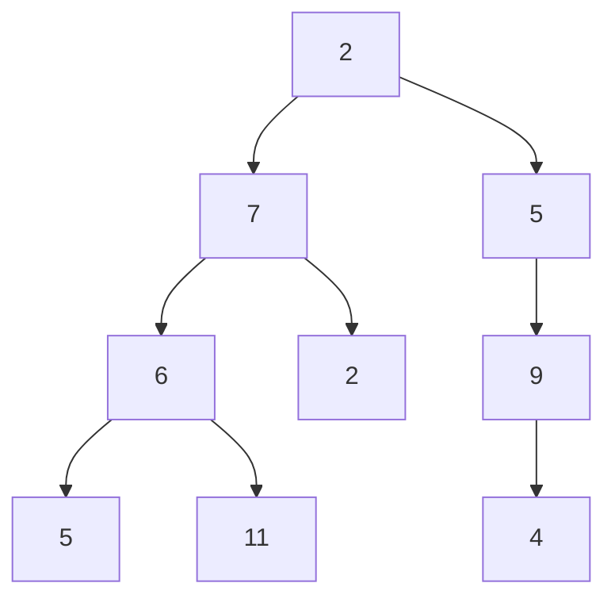
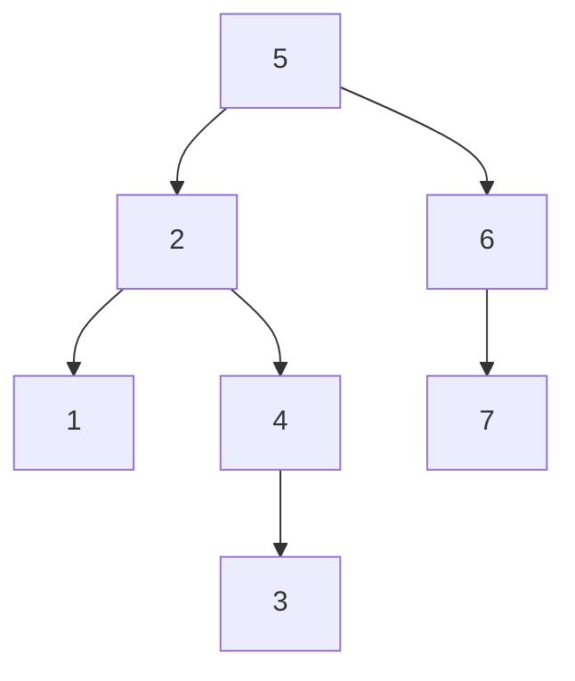

温故而知新，保持空杯心态,复习到一半的时间，突然发现了 [前端面试之道](https://yuchengkai.cn/docs/frontend)，按学习这本书的路径来

## JS 基础3

## 监控

前端监控一般分为三种，页面埋点、性能监控以及异常监控

### 页面埋点

页面埋点一般会监控下面几个数据：

- PV/UV
- 停留时长
- 流量来源
- 用户交互

实现的思路分成两种，手写埋点和无埋点的方式

第一种自主选择需要监控的数据然后在相应的地方写入代码，这种方式灵活性很大，唯一的缺点就是工作量大，每个需要监控的地方都要插入代码

另一种的无埋点的方式基本不需要开发者手写埋点，而是统计所有的事件并且定时上报，这种方式虽然没有前一种繁琐，但是因为统计的是所有事件，所以还需要后期过滤出需要的数据

### 性能监控

可以使用浏览器期自带的  [Performance API](https://link.juejin.im/?target=https%3A%2F%2Fdeveloper.mozilla.org%2Fzh-CN%2Fdocs%2FWeb%2FAPI%2FPerformance) 来实现功能。一行代码就可以获得页面中各种详细的性能

```javascript
performance.getEntriesByType('navigation')
/**
[
    PerformanceNavigationTiming:{
        connectEnd: 3.9999999999906777
        connectStart: 3.9999999999906777
        decodedBodySize: 0
        domComplete: 22873.60000000001
        domContentLoadedEventEnd: 22690.200000000004
        domContentLoadedEventStart: 22689.999999999996
        domInteractive: 22689.999999999996
        domainLookupEnd: 3.9999999999906777
        domainLookupStart: 3.9999999999906777
        duration: 22873.700000000015
        encodedBodySize: 0
        entryType: "navigation"
        fetchStart: 3.9999999999906777
        initiatorType: "navigation"
        loadEventEnd: 22873.700000000015
        loadEventStart: 22873.60000000001
        name: ""
        nextHopProtocol: ""
        redirectCount: 0
        redirectEnd: 0
        redirectStart: 0
        requestStart: 3.9999999999906777
        responseEnd: 726.4000000000124
        responseStart: 3.9999999999906777
        secureConnectionStart: 0
        serverTiming: []
        startTime: 0
        transferSize: 0
        type: "back_forward"
        unloadEventEnd: 0
        unloadEventStart: 0
        workerStart: 0
    }
]
*/
```


### 异常监控

对于代码运行错误，通常的办法是使用 window.onerror 拦截报错，该方法能拦截到大部分的详细报错信息，但是也有例外的

- 对于跨域的代码运行错误会显示 script error 对于这种情况需要给 script 标签添加 crossorigin 属性
- 对于某些浏览器可能不会显示调用栈信息，这种情况可以通过 arguments.callee.caller 来做栈递归

对于异步代码来说，可以使用 catch 的方式捕获错误。比如 Promise 可以直接使用 catch 函数，async await 可以使用 try catch

线上的代码是经过压缩的，打包的时候要设置 sourceMap

## 常考的面试题目：UDP 与 TCP 的区别是什么？

## UDP

UDP 协议是面向无连接，不需要在正式传递数据之前先连接双方，然后 UDP 协议只是数据报文的搬运工，不保证有序且不丢失的传递到对端，并且 UDP 协议也没有任何控制流量的算法，总的来说 UDP 相较于 TCP 更加的轻便

### 面向无连接

UDP 不要跟 TCP 一样在发送数据前进行三次握手建立连接，想发数据就可以发送了。

并且也只是数据的搬运工，不会对数据进行拆分和拼接操作。

具体来说：

- 在发送端，应用层将数据传递给传输层的 UDP 协议，UDP 只会给数据增加一个 UDP 头标识下是 UDP 协议，然后就传递给应用层了
- 在接收端，网络层将数据传递给传输层，UDP 只去除 IP 报文头就传递给应用层，不会任何拼接操作。

### 不可靠性

不可靠性体现在无连接上，通信都不需要建立连接，想发就发。不用备份，也不用关心对方是否已经正确接收到数据。UDP 没有拥塞控制，一直会以恒定的速度发送数据，即使网络条件不好，也不会对发送速率进行调整。这样实现的弊端是在网络条件不好的情况下可能会导致丢包，但是优点很明显是在某些实时性要求很高的场景（如电话会议）就需要使用 UDP 而不是 TCP

### 高效

UDP 的头部开销小，只有八字节，相比 TCP 的至少二十字节要小得多，在传输数据报文时是很高效的。


UDP 头部包含了以下几个数据：

- 两个十六位的端口号，分别为源端口（可选字段）和目标端口
- 整个数据报文的长度
- 整个数据报文的检验和（IPv4 可选字段），该字段用于发现头部信息和数据中的错误

### 传输方式

UDP 不止支持一对一的传输方式，同样支持一对多，多对一的方式，也就说说 UDP 提供了单播，多播，广播的功能。

### 适用的场景

在很多实时性要求很高的地方都可以看到 UDP 的身影

#### 直播

如果使用基于 TCP 的协议，TCP 会严格控制传输的正确性，一旦有某个数据对端没有收到，就会停下来直到对端收到这个数据。这种问题在网络条件不错的情况下不会有问题，但是如果网络差就会变成画面卡着，然后在继续播放下一帧的情况。

TCP 这种情况下会降低用户体验，不适合

#### 王者荣耀

作者说不知道王者荣耀底层是使用了什么协议，但是对于这种实时性很高的游戏来说，UDP 是跑不了的。用户体量相当大的情况下，如果使用 TCP 连接可能会出现服务器不够用情况，因为每台服务器可供支撑的 TCP 连接数据是有限制的。

## TCP


对于TCP 头部来说，以下几个字段是很重要的

- Sequence number，这个序号保证了 TCP 传输的报文都是有序的，对端可以通过序号顺序的拼接报文
- Acknowledgement Number，这个序号表示数据接收端期望接受的下一个字节编号是多少，同时也表示上一序号的数据已经收到
- Window Size,窗口大小，表示还能接受多少字节的数据，用于流量控制
- 标识符
  - UGR=1：该字段为一表示本数据报的数据部分包含紧急信息，是一个高优先级数据报文，此时紧急指针有效。紧急数据一定位于当前数据包数据部分的最前面，紧急指标标明了紧急数据的尾部。
  - ACK=1：该字段为一表示确认号字段有效。此外，TCP 还规定在连接建立后传送的所有报文段都必须要把 ACK 置为一
  - PSH=1：该字段为一表示接收端应该立即将数据 push 给应用层，而不是等到缓冲区满后再提交
  - RST=1：该字段为一表示当前 TCP 连接出现严重问题，可能需要重新建立连接，也可以用于拒绝非法的报文段和拒绝连接请求
  - SYN=1：当 SYN = 1,ACK=0时，表示当前报文段是一个连接请求报文。当 SYN=1,ACK=1时，表示当前报文daunt是一个同意连接的应答报文
  - FIN=1：该字段为一表示此报文是一个释放连接的请求报文

### 状态机

TCP 的状态机是很复杂的，并且与建立连接时的握手息息相关


一个重要的性能指标 RTT.该指标表示发送端发送数据到接收到对端所需的往返时间

### 建立连接三次握手


首先假设主动发起请求的一端为客户端，被动连接的一端称为服务端。不管是客户端还是服务端，TCP 连接建立完后都可以发送和接收数据，所以 TCP 是一个全双工的协议。

起初，两端都是 CLOSED 状态，在通信开始前，双方都会建立 TCB,服务端创建完TCB 后便进入 LISTEN 状态，此时开始等待客户端发送数据

#### 第一次握手

客户端向服务端发送连接请求报文段，该报文段中包含自身数据通讯初始序号。请求发送后，客户端便进入 SYN-SENT 状态

#### 第二次握手

服务端收到连接请求报文段后，如果同意连接，则会发送一个应答，该应答中也会包含自身的数据通讯初始序号，发送完成后便进入 SYN-RECEIVED 状态。

#### 第三次握手

当客户端收到连接同意的应答后，还要向服务端发送一个确认报文。客户端发完这个报文段后便进入 ESTABLISHED 状态，服务端接收到这个应答后也进入 ESTABLISHED 状态，此时连接建立成功

第三次握手中可以包含数据，通过快速打开（TFO）技术就可以实现这一功能。其中只要涉及到握手的协议，都可以使用类似 TFO 方式，客户端和服务端存储相同的 cookie ，下次握手发出 cookie 达到减少 RTT 的目的。

**为什么TCP 建立连接需要三次握手，明明两次就可以建立起连接？**

因为这是为了防止出现失效的连接请求报文段被服务端接收后，从而产生错误。

如果客户端发送了一个连接报文请求A，但是因为网络原因造成了超时，这时 TCP 会启动超时重传的机制再次发送一个连接请求报文B。此时请求顺利达到服务器，服务端应答完就建立了请求，然后接受数据后释放了连接。

假设这时候请求 A 在两端关闭后终于达到了服务端，那么此时服务端会认为客户端有需要建立 TCP 连接，从而应答了该请求并进入了 ESTABLISHED 状态，但是实际上客户端是 CLOSED 状态，那么就会导致服务端一直等待，造成资源的浪费。

在建立连接中，任意一端掉线，TCP 都会重发 SYN 包，一般会重试5次，在建立连接可能遇到 SYN Flood 攻击。遇到这种情况可以选择调低重试次数或者干脆在不能处理的情况下拒绝请求。

### 断开连接四次握手


TCP 是全双工的，在断开连接时两端都需要发送 FIN 和 ACK

#### 第一次握手

若客户端 A 认为数据发送完成，则它需要向服务端 B 发送连接释放请求。

#### 第二次握手

B 收到连接释放请求后，会告诉应用层就要释放 TCP 连接，然后会发送 ACK 包，并进入 CLOSE_WAIT 状态，此时表明 A 到 B 的连接已经释放，不再接收 A 发的数据了。但是因为 TCP 连接是双工的，所以 B 依旧可以发送数据给 A

#### 第三次握手

B 如果此时还有没有发完的数据会继续发送，完毕后向 A 发送连接释放请求，然后 B 便进入 LAST-ACK 状态。通过延迟确认的技术（通常有时间限制，否则对方会误认为需要重传），可以将第二次和第三次握手合并，延迟 ACK 包的发送

#### 第四次握手

A 收到释放请求后，向 B 发送确认应答，A 进入 TIME-WAIT 状态。该状态会持续 2MSL(最大生存期，指报文段在网络中生存的时间，超时会被抛弃)时间，若该时间段内没有 B 的重发请求的话，就会进入 CLOSED 状态。当 B 收到确认应答后，也便进入 CLOSED 状态

**为什么 A 要进入 TIME-WAIT 状态，等待 2MSL 时间后再进入CLOSED 状态？**

为了保证 B 能接受到 A 的确认应答，若 A 发完确认应答后直接进入 CLOSED 状态，如果确认应答因为网络问题一直没有到达，那么会造成 B 不能正常关闭

## ARQ 协议

ARQ 协议也就是超时重传机制。通过确认和超时机制保证了数据的正确送达，ARQ 协议包含停止等待 ARQ 和连续 ARQ 两种协议

### 停止等待 ARQ

#### 正常传输协议

只要 A 向 B 发送一段报文，都要停止发送并且启动一个定时器，等待对端应答，在定时器内接收到对端应答就取消定时器并发送下一段报文

#### 报文丢失或者出错

在报文传输过程中可能会出现丢包，这时候超过定时器设定的时间就会再次发送丢失的数据直到对端响应，所以需要每次都备份发送的数据

即使报文正常传输到对端，有可能出现在传输过程中的报文出错的问题。这时候对端会抛弃该报文并等待 A 端重传

一般定时器设定的时间会大于一个 RTT 的平均时间

#### ACK 超时或者丢失

对端传输的应答也可能出现丢失或者超时的情况，那么超过定时器时间 A 端照样会重报文，这时候 B 端会接收到相同序号的报文之后丢弃该报文并重传应答，直到 A 端发送下一个序号的报文。

在超时的情况下也可能会出现应答很迟到达，这时候 A 端会判断该序号是否已经接收过，如果接收过只需要丢弃应答即可。

假设在良好的网络环境中，每次发送数据都需要等待片刻肯定是不能接受的，这个协议看起来不是很高效。

### 连续ARQ

在连续 ARQ 中，发送端拥有一个发送窗口，可以在没有收到应答的情况下持续发送窗口内的数据，这样相比停止等待 ARQ 协议来说减少了等待时间，提高了效率

#### 累计确认

连续 ARQ 中，接收端会持续不断收到报文，如果和停止等待 ARQ 中接收一个报文就发送一个应答一样，就太浪费资源了。通过累计确认，可以在收到多个报文以后统一回复一个应答报文。报文中的 ACK 标示位可以用来告诉发送端这个序号之前的数据已经全部接收到了，下次请发送这个序号后的数据。

但是累计确认也有一个弊端，在连续接收报文时，可能会遇到接收到序号5 的报文后，并未接收到序号6 的报文，然而序号7 的报文已经接收。遇到这种情况，ACK 只能回复 6，这样就会造成发送端重复发送数据的情况。

#### 滑动窗口

TCP 中，两端其实都维护者窗口，分别为发送端窗口和接收端窗口

发送端窗口包含已经发送但未收到应答的数据和可以发送但是未发送的数据


发送端窗口是由接收端窗口剩余大小决定的。接收方会把当前接收窗口的剩余大小写入应答报文，发送端收到应答后根据该值和当前网络拥塞情况设置发送窗口的大小，所以发送窗口的大小是不断变化的。

当发送端接收到应答报文后，会随着窗口进入滑动。


滑动窗口是一个很重要概念，它帮助了 TCP 实现了流量控制的功能。接收方通过报文告知发送方还可以发送多少数据，从而保证了接收方能够来得及接收数据，防止出现接收方带宽已满，但是发送方还是一直发送数据的情况。

#### zero 窗口

在发送报文的过程中，可能会遇到对端出现零窗口的情况，在该情况下，发送端会停止发送数据，并启动 persistent timer.该定时器会定时发送请求给对端，让对端告知窗口大小。在重试次数超过一定次数后，可能会中断 TCP 链接。

### 拥塞处理

拥塞处理和流量控制不同，后者是作用于接收方，保证接收方来得及接收数据，而后者是作用于网络，防止过多的数据拥塞网络，避免出现网络负载过大的情况。

拥塞处理包括了四个算法，分别是：慢开始，拥塞避免，快速重传，快递恢复

#### 慢开始算法

慢开始算法，就是在传输开始时将发送窗口慢慢指数等级扩大，从而避免一开始就传输最大量数据导致网络阻塞。

慢开始算法步骤具体如下：

1. 连接初始设置拥塞窗口（Congestion Window）为 1 MSS(一个分段的最大数据量)
2. 每过一个 RTT 将窗口大小乘二
3. 指数级增加肯定不能没有限制的，所以有一个阈值限制，当窗口大于阈值就会启动拥塞避免算法

#### 拥塞避免算法

拥塞避免算法相比简单点，每过一个 RTT 窗口大小只加一，这样就能避免指数级增长导致网络拥塞，慢慢将大小调整到最佳值

在传输过程中可能定时器超时的情况，这时候 TCP 会认为网络拥塞，会马上进行一下步骤：

1. 将阈值设定为当前拥塞窗口的一半
2. 将拥塞窗口设定为 1MSS
3. 启动拥塞避免算法

#### 快速重传

快速重传一般和快恢复一起出现。一旦接收端收到的报文出现失序的情况，接收端只会回复最后一个顺序正确的报文序号。如果发送端收到三个重复的 ACK ,无需等待定时器超时而是启动快速重传算法。具体是：
TCP Taho 的实现：

- 将阈值设为当前阈值的一般
- 将拥塞窗口设为 1MSS
- 重新开始慢开始算法

TCP Reno 实现：

- 拥塞窗口减半
- 将阈值设定为当前拥塞窗口
- 进入块恢复阶段（重发对端需要的包，一旦接收到一个新的 ACK 答复就退出该阶段），这种方在丢失多个包的情况下就不那么友好了
- 使用拥塞避免算法

#### TCP New Ren 改进后的快恢复

**TCP New Reno** 算法改进了之前 **TCP Reno** 算法的缺陷。在之前，快恢复中只要收到一个新的 ACK 包，就会退出快恢复。

在 **TCP New Reno** 中，TCP 发送方先记下三个重复 ACK 的分段的最大序号。

假如我有一个分段数据是 1 ~ 10 这十个序号的报文，其中丢失了序号为 3 和 7 的报文，那么该分段的最大序号就是 10。发送端只会收到 ACK 序号为 3 的应答。这时候重发序号为 3 的报文，接收方顺利接收的话就会发送 ACK 序号为 7 的应答。这时候 TCP 知道对端是有多个包未收到，会继续发送序号为 7 的报文，接收方顺利接收并会发送 ACK 序号为 11 的应答，这时发送端认为这个分段接收端已经顺利接收，接下来会退出快恢复阶段。

### 小结

- TCP建立连接需要三次握手，断开连接需要四次握手
- 滑动窗口解决了数据的丢包、顺序不对和流量控制的问题
- 拥塞窗口实现了对流量的控制，保证全天候环境下最优的传递数据

## HTTP 以及 TLS

### HTTP 请求的内容

HTTP 请求由三部分组成，分别是：

- 请求行
- 首部
- 实体

请求行基本由请求方法、URL、版本协议组成。

请求方法分很多种，POST,GET,HEAD,OPTION,等等，更多具体的[点击这里](https://developer.mozilla.org/zh-CN/docs/Web/HTTP/Methods)

### 副作用和幂等

副作用是指对服务器上的资源做改变，搜素是无副作用的，注册是副作用的。

幂等指发送 M 和 N 次请求（两者不同且大于1），服务器上资源的状态一致，比如注册10个和11个账号是不幂等的，对文章进行更改10次和11次是幂等的。因为前者多了一个账号（资源），后者只是更新同一个资源

在规范的应用场景来说，Get 多用于无副作用的，幂等的场景，例如搜索关键字。Post 多用于副作用的，不幂等的场景，例如注册

技术上来说：

- Get 请求能缓存，Post 不能
- Post 相对 Get 安全一点，因为GET 请求都包含在 URL 里面，且会被浏览器保存历史记录。而 Post 不会，但是在抓包的情况下是一样的。
- URL 有长度限制，会影响 GET 请求，但是这个长度限制是浏览器限制的，不是 RFC 规定的
- Post 支持更多的编码并且不对数据类型限制

### 首部

首部分成请求首部和响应首部，并且部分首部两种通用。下面是常见的首部

#### 通用首部

| 通用字段          | 作用                                          |
| ----------------- | --------------------------------------------- |
| Cache-Control     | 控制缓存的行为                                |
| Connection        | 浏览器想要优先使用的连接类型，比如 keep-alive |
| Date              | 创建报文的时间                                |
| Pragma            | 报文指令                                      |
| Via               | 代理服务器相关信息                            |
| Transfer-Encoding | 制定报文主体的传输编码方式                    |
| Upgrade           | 要求客户端升级协议                            |
| Warning           | 在内容中可能存在错误                          |

具体解释的可以[点击这里](http://laibh.top/2018-08-16-read-%E5%9B%BE%E8%A7%A3HTTP-Part6%E4%B8%8A.html)

#### 请求首部

| 请求首部            | 作用                               |
| ------------------- | ---------------------------------- |
| Accept              | 能正确接收的媒体类型               |
| Accept-Charset      | 能正确接收的字符集                 |
| Accept-Encoding     | 能正确接收的编码格式列表           |
| Accept-Language     | 能正确接收的语言列表               |
| Expect              | 期待服务端的指定行为               |
| From                | 请求方邮箱地址                     |
| Host                | 服务器的域名                       |
| If-Match            | 两端资源标记比较                   |
| If-Modified-Since   | 本地资源未修改返回 304（比较时间） |
| If-None-Match       | 本地资源未修改返回 304（比较标记） |
| User-Agent          | 客户端信息                         |
| Max-Forwards        | 限制可被代理以及网关转发的次数     |
| Proxy-Authorization | 向代理服务器发送验证信息           |
| Range               | 请求某个内容的一部分               |
| Referer             | 表示浏览器所访问的前一个页面       |
| TE                  | 传输编码方式                       |

#### 响应首部

| 响应头部           | 作用                       |
| ------------------ | -------------------------- |
| Accept-Ranges      | 是否支持某些种类的范围     |
| Age                | 资源在代理缓存中存在的时间 |
| ETag               | 资源标识                   |
| Location           | 客户端重定向到某个 URL     |
| Proxy-Authenticate | 想代理服务器发送验证信息   |
| Server             | 服务器名字                 |
| WWW-Authenticate   | 获取资源需要的验证信息     |

#### 实体首部

| 实体首部         | 作用                             |
| ---------------- | -------------------------------- |
| Allow            | 资源的正确请求方式               |
| Content-Encoding | 内容编码的格式                   |
| Content-Language | 内容使用的语言                   |
| Content-Length   | request body 长度                |
| Content-Location | 返回数据的备用地址               |
| Content-MD5      | Base64 加密格式的内容 MD5 校验值 |
| Content-Range    | 内容的位置范围                   |
| Content-Type     | 内容的媒体类型                   |
| Expires          | 内容的过期时间                   |
| Last_modified    | 内容的最后修改时间               |

### 常见的状态码

状态码的责任是当客户端向服务端发送请求时，描述返回的请求结果。借助状态码，用户可以知道服务单是正常处理了请求，还是出现了错误。

#### 状态码的类别

|      | 类别                             | 原因短语                   |
| :--- | :------------------------------- | :------------------------- |
| 1XX  | Information（信息性状态码）      | 接受的请求正在处理         |
| 2XX  | Success（成功状态码）            | 请求正常处理完毕           |
| 3XX  | Redirection（重定向状态码）      | 需要进行附加操作以完成请求 |
| 4XX  | Client Error（客户端错误状态码） | 服务器无法处理请求         |
| 5XX  | Server Error（服务器错误状态码） | 服务器处理请求出错         |

#### 2XX 成功

- 200 OK,表示从客户端发来的请求在服务端被正确处理
- 204，No content，表示请求成功，但响应报文不含实体的主体部分
- 205，Reset Content，表示请求成功，但响应报文不含实体的主体部分，与204响应不同的是要求请求方重置内容
- 206 Partial Content，表示对客户端进行了范围请求，而服务器成功执行了这部分的 GET 请求，响应报文中由 Content-Range 指定范围的实体内容

#### 3XX 重定向

- 301 moved permanently,永久性重定向，表示资源已被分配到了新的 URL
- 302 found,临时重定向，表示资源临时被分配了新的 URL
- 303 see other，表示资源存在着另一个 URL应使用 GET 方法获取资源
- 304 not modified，表示服务器允许访问资源，但因发生请求未满足条件的情况
- 307 temporary redirect，临时重定向，和302含义类似，但是期望客户端保持请求方法不变向新的地址发出请求。

#### 4XX 客户端错误

- 400 bad request，请求报文存在语法错误
- 401 unauthorized，表示发送的请求需要有通过 HTTP 认证的认证消息
- 403 fobidden，表示对请求资源的访问被服务器拒绝
- 404 no found,表示在服务器上没有找到请求的资源

#### 5XX 服务器错误

- 500 internal server error,表示服务器端在执行请求时发生了错误
- 501 Not Implemented,表示服务器不支持当期请求所需要的某个功能
- 503 service unavaliable,表示服务器暂时处于超负载或者停机服务，无法处理请求

### TLS

HTTPS 通过 HTTP 来传输信息，但是信息通过 TLS 协议进行了 加密

TLS 协议位于传输层之上，应用层之下。首先进行 TLS 协议传输需要两个 RTT,可以通过 Session Resumption 减少到一个 RTT

在 TLS 中使用了两种加密技术，分别为：对称加密和非对称加密。

#### 对称加密

对称加密就是两边都拥有相同的密钥，两边都知道药怎么将密文加密解密

这种加密方式缺点在于因为传输数据走的都是网络，如果密钥被截获那就没有加密的意义了

#### 非对称机密

有公钥私钥之分，公钥所有人都可以知道，如果将数据用公钥加密，但是将数据解密必须使用私钥解密，私钥只有分发公钥的一方才知道。

这种加密方式就可以完美解决对称加密存在的问题，假设两端都需要使用对称加密，那么在这之前，可以先使用非对称加密交换密钥。

简单流程化如下：服务端将公钥发布出去，那么客户端也知道公钥，就下来客户端创建了一个密钥，然后通过公钥加密后发送给服务端，服务端接收到私钥解密出正确的密钥，这时候两端就都知道密钥是什么了。

TLS 握手过程如下图：


1. 客户端发送一个随机值以及需要的协议和加密方式
2. 服务端收到客户端的随机值，自己也产生了一个随机值，并根据客户端的需求的协议和加密方式来使用对应的方式，并且发送自己的证书（如果需要验证客户端证书需要说明）
3. 客户端收到服务端的证书验证是否有效，验证通过会生成一个随机值，通过服务端证书的公钥加密这个随机值并发送给服务端，如果服务端需要验证客户端证书的话会附带证书
4. 服务端收到加密过的随机值并使用私钥解密获得三个随机值，这时候两端都有三个随机值，可以通过这三个随机值按照之前的约定的加密方式生成密钥，接下来的通信既可以使用该密钥加密解密了。

通过上面步骤，可以知道 TLS 握手阶段，两端使用非对称加密的方式进行通信，但是因为非对称加密损耗的性能比对称加密大，所以在正式传输数据的时候，两端使用对称加密的方式进行通信。

关于 http 安全的具体可以[点击这里](http://laibh.top/2018-08-29-read-%E5%9B%BE%E8%A7%A3HTTP-Part7.html)

### HTTP/2 以及 HTTP/3

HTTP/2 很好的解决了当下最常用的 HTTP/1 所存在的一些性能问题，只需要升级到该协议就可以减少很多之前需要做的性能优化工作，当然兼容问题以及如何优雅降级应该是国内还不普遍使用的原因之一。

虽然 HTTP/2 已经解决了很多问题，但是并不代表它已经是完美的了，HTTP/3 就是为了解决 HTTP/2 所存在的一些问题而被推出来的。

### HTTP/2

HTTP/2 相比对 HTTP/1 可以说是大幅度提高了网页的性能。

在 HTTP/1 为了性能考虑，我们会引入雪碧图、将小图内联、使用多个域名等等的方式。这一切都是因为浏览器限制了同一个域名下的请求数量（Chrome 下一般是限制六个连接），当页面中需要请求很多资源的时候，队头阻塞（Head of line blocking）会导致在达到最大请求数量时，剩余的资源需要等待其他资源请求完成后才能发起请求。

在 HTTP/2 中引入了多路复用的技术，这个技术可以只通过一个 TCP 连接就可以传输所有的请求数据。多路复用很好的解决了浏览器限制同一个域名下的请求数量的问题，同时也接更容易实现全速传输，毕竟新开一个 TCP 连接都需要慢慢提升传输速度。

大家可以通过 [该链接](https://link.juejin.im/?target=https%3A%2F%2Fhttp2.akamai.com%2Fdemo) 感受下 HTTP/2 比 HTTP/1 到底快了多少。

### 二进制传输

HTTP/2 中所有加强性能的核心在于此，在之前的 HTTP 版本，我们是通过文本的方式传输数据，在 HTTP/2 中引入了新的编码机制，所有的传输数据都会被分割，并采用二进制格式编码。


### 多路复用

在 HTTP/2 中有两个非常重要的概念，分别是 帧（frame）和 流 （stream）

帧代表着最小的数据单位，每个帧都会标识出该帧属于哪个流，流也就是多个帧组成的数据流

多路复用，就是在一个 TCP 连接中可以存在多条流。换句话说，就是可以发送多个请求，对端可以通过帧中的标识知道属于哪个请求。通过这个技术，可以避免 HTTP 旧版本中的对头阻塞的问题，极大提高了传输的性能。

### Header 压缩

在 HTTP/1 中使用文本的形式传输 header，在 header 携带 cookie 的情况下，可能每次都需要重复传输几百到几千字节。

在 HTTP/2 中使用 HPACK 压缩格式对传输的 header 进行编码，减少了 header 的大小。并在两端维护了索引表，用于记录出现过的 header。后面在传输过程中可以传输以及记录过的 header 的键名，对端收到的数据后就可以通过键名找到对应的值

### 服务端 Push

在 HTTP/2 中，服务端可以在客户端某个请求后，主动推送其他资源

某些资源客户端是一定会请求的，这时候可以采用服务端 push 的技术，提前给客户端推送必要的资源，这样就可以相对减少一点延迟时间。当然在浏览器兼容的情况下也可以使用 prefetch

### HTTP/3 

底层的 TCP 协议导致 HTTP/2 版本存在一个问题，因为使用了多路复用，一般来说同一个域名下面只需要一个 TCP 连接。当这个连接中出现了丢包的情况，就会导致 HTTP/2 的表现不如 HTTP/1

在丢包的情况下，整个 TCP 都要开始等待重传，就导致了后面的所有的数据都会被阻塞。但是对于 HTTP/1 来说可以开启多个 TCP 连接，出现这种情况只会影响一个连接，剩余的 TCP 连接可以正常传输数据

这个协议是由操作系统实现的，如果要去修改 TCP 协议看起来不怎么现实。

基于这个原因，Google 就更起炉灶搞了一个基于 UDP 协议的 QUIC 协议，并且使用在了 HTTP/3 上，

HTTP/3 之前名为 HTTP-over-QUIC

#### QUIC

UDP 协议虽然效率很高，但是并不是那么的可靠.QUIC 是基于 UDP ,在原生的基础上新增了很多功能，比如多路复用、0-RTT、使用 TLS1.3 加密、流量控制、有序交付、重传等功能。

#### 多路复用

虽然 HTTP/2 支持多路复用，但是 TCP 协议终究是没有这个功能的。QUIC 就原生实现了这个功能，并且传输的单个数据流可以保证有序交付但不会影响其他的数据流，这样的技术就解决了之前的 TCP 存在的问题。

并且 QUIC 在移动端会比 TCP 好，因为 TCP 是基于 IP 和端口去识别连接的，这种方式在多变的移动端网络环境下是很脆弱的。但是因为 QUIC 是通过 ID 的方式去识别一个连接的，不会随着网络的变化而变化，可以迅速重连上。

#### 0-RRT

通过使用类似 TCP 的快速打开的技术，缓存当前会话的上下文，在下次恢复会话的时候，只需要将之前的缓存传递给服务端验证通过就可以进行传输了。

#### 纠错机制

假如说这次我要发送三个包，那么协议会算出这三个包的异或值并单独发出一个校验包，也就是总共发出了四个包。当出现其中的非校验丢包的 情况的时候，可以通过另外三个包计算出丢失的数据包的内容。

当然这种技术只能使用在丢失一个包的情况下，如果出现丢失多个包就不能使用纠错机制了，只能使用重传的方式了。

#### 小结

- HTTP/2 通过多路复用、二进制流、header 压缩等技术，极大提高了性能，但是还是存在着问题
- QUIC 基于 UDP 实现，是 HTTP/3 中底层支撑协议，该协议基于 UDP，而且拿了 TCP 中的精华，实现了又快有可靠的协议

关于 HTTP/3 更多[点击这里](http://www.sohu.com/a/299243519_115128)

## 输入 URL 到页面渲染的整个过程

首先是 DNS 查询，如果这一步做到了智能 DNS 解析的话，会提供速度最快的 IP 地址回来

### DNS

DNS 的作用就是通过域名查询到具体的 IP 地址

因为 IP 存在数据和英文的组合（IPv6），不利于记忆，所以就出现了域名，可以把它看成某个 IP 地址的别名，DNS 就是通过这个别名去查询真正的名字是什么

在 TCP 握手之前以及先进行了 DNS 查询，这个查询是操作系统自己做的，在浏览器中访问 www.googel.com 的时候，会进行以下的操作：

1. 操作系统会首先在本地缓存中查询 IP
2. 没有的话就会去系统配置的 DNS 服务器中查询
3. 如果这时候还没有找到，就会直接去 DNS 根服务器查询，这一步查询会找出负责 `com`这个域名的服务器
4. 然后去该服务器查询  `google`这个二级域名
5. 接下来是三级域名的查询，这个是我们自己配置的，可以给 `www` 这个域名配置一个IP,然后还可以给别的三级域名配置一个 IP

上面是DNS 迭代查询，还有一种格式递归查询，区别就是前者是由客户端去做请求，后者是由系统配置的 DNS 服务器做请求，得到结果将数据返回给客户端。

DNS 是基于 UDP 做的查询

接下来是 TCP 握手协议，应用层会下发数据给传输层，这里的 TCP 协议会指明两端的端口号，然后下发给网络层。网络层的 IP 协议会确定 IP 地址，并制定了数据传输中如何跳转路由器。然后包会再被封装到数据链路层的数据帧结构中，最后就是物理层面的传输了。

在这一部分中，TCP 握手结束后，会进行 TLS 握手，然后开始正式的传输数据了。

数据在进入服务端之前，可能还会警告负责负载均衡的服务器，它的作用是将请求合理的分发到多态服务器上面，这时假设服务端会响应一个 HTML 文件

首先浏览器会判断状态码是什么，如果是200 就继续解析，如果是 400 或者 500 的话就会报错，如果是 300 就会重定向，这里会有一个 重定向计数器，避免多次的重定向，超过次数也会报错。

浏览器开始解析文件，如果是 gzip 格式的会先解压一下，然后通过文件的编码格式知道该如何取解码文件。

文件解码后就会正式开始渲染流程，先根据 HTML 创建 DOM 树，有 CSS 的话就是 CSSOM 树，如果遇到 script 标签的话，会判断是否存在 async 或者 defer,前者会并行进行下载并执行 JS,后者会先下载文件，然后等待 HTML 解析完成后顺序执行。

如果以上都没有，就会阻塞住渲染流程直到 JS 执行完毕。遇到下载文件就会去下载文件，如果使用 HTTP/2 协议的话就会极大提高多图的下载效率

CSSOM 树 和 DOM 树构建完成之后会生成 render 树，这一步就是确定页面布局、样式等诸多方面的东西。

在生成 Render 树的过程中，浏览器就会开始调用 GPU 绘制，合成图层，将内容显示在 屏幕上了。

关于这个流程，更多的可以[点击这里](https://github.com/skyline75489/what-happens-when-zh_CN)

## 设计模式

关于具体的设计模式我有过一些[笔记](http://laibh.top/tags/javaScript%E6%95%B0%E6%8D%AE%E7%BB%93%E6%9E%84%E4%B8%8E%E7%AE%97%E6%B3%95/)

下面还是根据作者的脚步来回顾这一点知识点

### 工厂模式

有一份很复杂的代码需要用户去调用，但是用户并不关心这些代码是怎么实现的，只需要提供一个接口去调用，用户只负责传递需要的参数。参数的使用都在内部逻辑去完成，不暴露出来给用户。只要给用户返回一个实例，这种构造过程就是工厂。

简而言之就是隐藏了创建实例的复杂度，只需要提供一个接口

```javascript
class Man{
    constructor(name){
        this.name = name
    }
    alertName(){
        alert(this.name)
    }
}

class Factory{
    static create(name){
        return new Man(name)
    }
}

Factory.create('haha').alertName()
```

Vue 源码中，也可以看到工厂模式的使用，比如创建异步组件

```tsx
export function createComponent(
  Ctor: Class<Component> | Function | Object | void,
  data: ?VNodeData,
  context: Component,
  children: ?Array<VNode>,
  tag?: string
): VNode | Array<VNode> | void {

  // 逻辑处理...

  const vnode = new VNode(
    `vue-component-${Ctor.cid}${name ? `-${name}` : ''}`,
    data, undefined, undefined, undefined, context,
    { Ctor, propsData, listeners, tag, children },
    asyncFactory
  )

  return vnode
}
```

在上述代码中，我们可以看到我们只需要调用 `createComponent` 传入参数就能创建一个组件实例，但是创建这个实例是很复杂的一个过程，工厂帮助我们隐藏了这个复杂的过程，只需要一句代码调用就能实现功能。

### 单例模式

单例模式很常用，比如全局缓存、全局状态管理等等只需要一个对象，就可以使用单例模式

单例模式的核心就是保证全局只有一个对象可以访问。因为 JS 是门无类的语言，所以别的语言实现单例的方式不能套入 JS 中，我们需要用一个变量确保值创建一次就可以了，下面是如何实现单例模式的例子：

```javascript
  class Singleton {
    constructor() { }
  }
  Singleton.getInstance = (function () {
    let instance;
    return function () {
      if (!instance) {
        instance = new Singleton()
      }
      return instance;
    }
  })()

  let s1 = new Singleton.getInstance();
  let s2 = new Singleton.getInstance();
  console.log(s1 === s2); // true
```

在 Vuex 源码中也可以看到单例模式的运用，虽然实现的方式不大一样，通过一个外部变量来控制只安装一次 Vuex

```javascript
let Vue // bind on install
export function install (_Vue){
    if(Vue && Vue === Vue){
       // 如果发现 Vue 有值，就不重新创建实例了
       return;
    }
    Vue = _Vue;
    applyMixin(Vue)
}
```

### 适配器模式

适配器用来解决两个接口不兼容的情况，不需要改变已有的接口，通过包装一层的方式实现两个接口的正常协作

简单实现：

```javascript
class Plug{
    getName(){
        return '港版插头'
    }
}
class Target{
    constructor(){
        this.plug = new Plug()
    }
    getName(){
        return this.plug.getName() + ' 适配转二脚插头'
    }
}

let target = new Target();
target.getName(); // 港版插头 适配转二脚插头
```

在 Vue 中经常使用到适配器模式，比如父组件传递给子组件一个时间戳属性，组件内部需要将时间戳转为正常的日期显示，一般会使用 computed 来做转换这件事情，这个过程就是用到了适配器模式

### 装饰模式

装饰模式不需要改变已有的接口，作用是给对象添加功能，就像我们经常需要给手机戴个保护套防摔一样，不改变手机自身，给手机添加了保护套提供防摔的功能。

以下是如何实现装饰模式的例子，使用了 ES7 中的装饰器语法

```javascript
function readonly(target,key,descriptor){
    descriptor.writable = false;
    return descriptor
}

class Test{
    @readonly
    name = 'haha'
}

let t = new Test();
t.haha = '11'; // 不可修改
```

在 React 中，装饰模式是随处可见的

```javascript
import { connect } from 'react-redux';
class MyComponent extends React.Component{
    // ..
}
export default connect(mapStateToProps)(MyComponent)
```

### 代理模式

代理是为了控制对对象的访问，不让外部直接访问到对象，事件代理也是用到了代理模式

```html
<ul id="ul">
    <li>1</li>
    <li>2</li>
    <li>3</li>
    <li>4</li>
    <li>5</li>
</ul>
<script>
    let ul = document.querySelector('#ul');
    ul.addEventListener('click',(e)=>{
        console.log(e.target);
    })
</script>
```

因为存在太多 li，不可能每个都去绑定事件，这时候可以通过给父节点绑定一个事件，让父节点作为代理去拿到真实点击的节点。

### 发布-订阅模式

发布-订阅模式也叫做观察者模式，通过一对一或者一对多的依赖关系，当对象发生改变的时候，订阅方都会收到通知。现实生活中的例子是当我需要在购物网站购买一个产品的时候，但是发现该产品目前处于缺货状态，这时候我们可以点击有货通知的按钮，让网站在产品有货的时候通过短信通知我。

在实际代码中，其实发布-定于模式也很常见，比如我们点击一个按钮触发了点击事件其实就是使用了该模式

```html
<ul id="ul"></ul>
<script>
    let ul = document.querySelector('#ul');
    ul.addEventListener('click',(e)=>{
        console.log(e.target);
    })    
</script>
```

在 Vue 中，如何实现响应式也是使用了该模式，对于需要实现想爱你过隐式的对象来说，在 get 的时候会进行依赖手机，当改变了对象的属性的时候，就会触发派发更新

### 外观模式

外观模式提供了一个接口，隐藏了内部的逻辑，更加方便外部的调用

我们需要实现一个兼容多种浏览器的添加事件方法

```javascript
  function addEvent(elm, evType, fn, useCapture) {
    if (elm.addEventListener) {
      elm.addEventListener(evType, fn, useCapture);
      return true
    } else if (elm.attachEvent) {
      return elm.attachEvent('on' + evType, fn)
    } else {
      elm["on" + evType] = fn
    }
  }
```

对于不同的浏览器，添加事件的方式可能会存在兼容问题，如果每次都要这样写一遍是不可能，我们将逻辑判断统一在一个接口里面，外部需要添加事件只需要调用 addEvent 就可以了

## 常见数据结构

关于数据结构我之前的笔记也有过记录，具体的可以[点击这里](http://laibh.top/tags/javaScript%E6%95%B0%E6%8D%AE%E7%BB%93%E6%9E%84%E4%B8%8E%E7%AE%97%E6%B3%95/)

下面还是跟着作者来重温一遍常见的数据结构

### 大O表示法

如何衡量算法的效率？通常是用资源，例如CPU（时间）占用、内存占用、硬盘占用和网络占用。当讨论大O表示法时，一般考虑的是CPU（时间）占用。

分析算法时，时常遇到以下几类函数

| 符号           | 名称         |
| :------------- | :----------- |
| *O(1)*         | 常数的       |
| *O(log(n))*    | 对数的       |
| *O((log(n)c))* | 对数多项式的 |
| *O(n)*         | 线性的       |
| *O(n2)*        | 二次的       |
| *O(nc)*        | 多项式的     |
| *O(cn)*        | 指数的       |

### 常用数据结构的时间复杂度

#### 数据结构

| 数据结构     | 一般情况    |             |             | 最差情况    |             |             |
| :----------- | :---------- | :---------- | :---------- | :---------- | :---------- | :---------- |
|              | 插入        | 删除        | 搜索        | 插入        | 删除        | 搜索        |
| 数组-栈-队列 | *O(1)*      | *O(1)*      | *O(n)*      | *O(1)*      | *O(1)*      | *O(n)*      |
| 链表         | *O(1)*      | *O(1)*      | *O(n)*      | *O(1)*      | *O(1)*      | *O(n)*      |
| 双向链表     | *O(1)*      | *O(1)*      | *O(n)*      | *O(1)*      | *O(1)*      | *O(n)*      |
| 散列表       | *O(1)*      | *O(1)*      | *O(1)*      | *O(n)*      | *O(n)*      | *O(n)*      |
| 二分搜索树   | *O(log(n))* | *O(log(n))* | *O(log(n))* | *O(n)*      | *O(n)*      | *O(n)*      |
| AVL树        | *O(log(n))* | *O(log(n))* | *O(log(n))* | *O(log(n))* | *O(log(n))* | *O(log(n))* |

#### 排序算法

| 算法（用于数组） | 最好情况     | 一般情况     | 最差情况     |
| :--------------- | :----------- | :----------- | :----------- |
| 冒泡排序         | *O(n)*       | *O(n2)*      | *O(n2)*      |
| 选择排序         | *O(n2)*      | *O(n2)*      | *O(n2)*      |
| 插入排序         | *O(n)*       | *O(n2)*      | *O(n2)*      |
| 归并排序         | *O(nlog(n))* | *O(nlog(n))* | *O(nlog(n))* |
| 快速排序         | *O(nlog(n))* | *O(nlog(n))* | *O(n2)*      |
| 堆排序           | *O(nlog(n))* | *O(nlog(n))* | *O(nlog(n))* |
| 桶排序           | *O(n+k)*     | *O(n+k)*     | *O(n2)*      |
| 基数排序         | *O(nk)*      | *O(nk)*      | *O(nk)*      |

### 栈

栈是一个线性结构，在计算机中是一个相当常见的数据结构，栈的特点是只能在某一端添加或者删除数据，遵循先进后出的规则（FILO）的原则

#### 实现

```javascript
  class Stack {
    constructor() {
      this.stack = []
    }
    // 添加一个或者结构新元素到栈顶
    push(item) {
      this.stack.push(item)
    }
    // 移除栈顶的元素
    pop() {
      return this.stack.pop();
    }
    // 返回栈顶的元素
    peek() {
      return this.stack[this.size() - 1]
    }
    size() {
      return this.stack.length
    }
    isEmpty() {
      return this.size() === 0
    }
    clear() {
      this.stack = [];
    }
    getStack() {
      return this.stack;
    }
  }
```

#### 应用

题意是匹配括号，可以通过栈的特性来完成这道题目

```javascript
  const isVaild = function (s) {
    let map = {
      "(": -1,
      ")": 1,
      "[": -2,
      "]": 2,
      "{": -3,
      "}": 3,
    }
    const stack = new Stack();
    for (let i = 0; i < s.length; i++) {
      if (map[s[i]] < 0) {
        stack.push(s[i])
      } else {
        let last = stack.pop()
        if (map[last] + map[s[i]] != 0) return false
      }
    }
    if (stack.size() === 0) return true
    return false
  }
```

在 Vue  中关于模板解析的代码，就有应用到匹配尖括号的内容

### 队列

队列是一个线性结构，特点是在某一段添加数据，在另一端删除数据，遵循先进先出的原则（FIFO）

#### 实现

分成单链队列和循环队列

##### 单链队列

```javascript
class Queue {
  constructor() {
    this.queue = []
  }
  enQueue(item) {
    this.queue.push(item)
  }
  deQueue() {
    return this.queue.shift();
  }
  front() {
    return this.queue[0]
  }
  size() {
    return this.queue.length
  }
  isEmpty() {
    return this.size() === 0
  }
  clear() {
    this.queue = [];
  }
}
```

因为单链队列在出队操作的时候㤇 O(n)的时间复杂度，所以引入了循环队列，循环队列的出队操作平均是 O(1)的时间复杂度

##### 循环队列

```javascript
class sqQueue {
  constructor(length) {
    this.queue = new Array(length - 1);
    // 队头
    this.first = 0;
    // 队尾
    this.last = 0;
    // 当前队列的大小
    this.size = 0;
  }
  enQueue(item) {
    // 如果队尾 +1 是否为队头，如果是就代表需要扩容数组，%this.queue.length 是为了防止数组越界
    if (this.first === (this.last + 1) % this.queue.length) {
      this.resize(this.size() * 2 + 1)
    }
    this.queue[this.last] = item;
    this.size++;
    this.last = (this.last + 1) % this.queue.length
  }
  deQueue() {
    if (this.isEmpty()) {
      throw Error('Queue is empty');
    }
    let r = this.queue[this.first];
    this.queue[this.first] = null;
    this.first = (this.first + 1) % this.queue.length;
    this.size--;
    // 判断当前队列是否过小，为了保证不浪费空间，在队列空间等于总长度四分之一的时候且不为2时缩小总长度为当前的一半
    if (this.size === this.size() / 4 && this.size() / 2 !== 0) {
      this.resize(this.size() / 2);
    }
    return r;
  }
  front() {
    if (this.size()) {
      throw Error('Queue is empty');
    }
    return this.queue[this.first]
  }
  size() {
    return this.queue.length - 1;
  }
  isEmpty() {
    return this.first === this.last;
  }
  resize(length) {
    let q = new Array(length);
    for (let i = 0; i < length; i++) {
      q[i] = this.queue[(i + this.first) % this.queue.length]
    }
    this.queue = q;
    this.first = 0;
    this.last = this.size
  }
}
```

### 链表

链表是一个线性结构，同时也是一个天然的递归结构。链表结构可以充分利用计算机内存空间，实现灵活的内存活动管理。但是链表失去了数组随机读取的优点，同时链表也增加了结点的指针域，空间开销比较大。

#### 实现

单向链表

```javascript
class LinkList {
  constructor() {
    // 链表长度
    this.size = 0;
    // 虚拟头部
    this.dummyNode = new Node(null, null);
  }
  find(header, index, currentIndex) {
    if (index === currentIndex) return header
    return this.find(header.next, index, currentIndex + 1);
  }
  addNode(v, index) {
    this.checkIndex(index);
    // 当往链表末尾插入时，prev.next 为空，其他情况时，因为要插入节点，所以插入的节点的next 应该是 prev.next 然后设置 prev.next 为插入的节点
    let prev = this.find(this.dummyNode, index, 0);
    prev.next = new Node(v, prev.next);
    this.size++;
    return prev.next;
  }
  insertNode(v, index) {
    return this.addNode(v, index);
  }
  addToFirst(v) {
    return this.addNode(v, 0);
  }
  addToLast(v) {
    return this.addNode(v, this.size);
  }
  removeNode(index, isLast) {
    this.checkIndex(index);
    index = isLast ? index - 1 : index;
    let prev = this.find(this.dummyNode, index, 0);
    let node = prev.next;
    prev.next = node.next;
    node.next = null;
    this.size--;
    return node;
  }
  removeFirstNode() {
    return this.removeNode(0);
  }
  removeLastNode() {
    return this.removeNode(this.size, true);
  }
  checkIndex(index) {
    if (index < 0 || index > this.size) throw Error('Index error');
  }
  getNode(index) {
    this.checkIndex(index);
    if (this.isEmpty()) return;
    return this.find(this.dummyNode, index, 0).next;
  }
  isEmpty() {
    return this.size === 0;
  }
  size() {
    return this.size;
  }
}
```

### 树

#### 二叉树

树拥有很多种结构，二叉树是树中最常见的结构，同时也是一个天然的递归结构

二叉树拥有一个根节点，每个节点至多拥有两个子节点，分别为：左节点和右节点。树的最底部节点称之为叶节点，当一棵树的数量为满，该树就可以称之为二叉树




#### 二分搜索树

二分搜索树也是二叉树，拥有二叉树的特性。但是区别于在二分搜索树每个节点的值都比它的左子树的值大，比右子树的值小。

这种存储方式很适合数据搜索。如下图显示，当需要查找6的时候，因为需要查找的值比根节点的值大，所以只需要在根节点的右子树上寻找，大大提高了搜索效率



#### 实现

具体可以[点击这里](http://laibh.top/2018-11-05-JavaScipt%E6%95%B0%E6%8D%AE%E7%BB%93%E6%9E%84%E4%B8%8E%E7%AE%97%E6%B3%95Part8.html)

## CSS 常考面试题目资料

- [50道CSS基础面试题（附答案）](https://link.juejin.im/?target=https%3A%2F%2Fsegmentfault.com%2Fa%2F1190000013325778)
- [《50道CSS基础面试题（附答案）》中的答案真的就只是答案吗？](https://link.juejin.im/?target=https%3A%2F%2Fsegmentfault.com%2Fa%2F1190000013860482)
- [CSS 面试题总结](https://link.juejin.im/?target=https%3A%2F%2Ffunteas.com%2Ftopic%2F5ada8eac230d1e5e25e45b89)
- [front-end-interview-handbook](https://link.juejin.im/?target=https%3A%2F%2Fgithub.com%2Fyangshun%2Ffront-end-interview-handbook%2Fblob%2Fmaster%2FTranslations%2FChinese%2Fquestions%2Fcss-questions.md)

## 推荐的资料

### JS

- [You-Dont-Know-JS](https://link.juejin.im/?target=https%3A%2F%2Fgithub.com%2Fgetify%2FYou-Dont-Know-JS)，这套书深入的讲解很多 JS 的内容，英文版是开源免费阅读的，如果你英文不好的话，国内这套书已经有出版了，可以选择购买。
- [Functional-Light-JS](https://link.juejin.im/?target=https%3A%2F%2Fgithub.com%2Fgetify%2FFunctional-Light-JS)，这本书是讲解函数式编程的，函数式编程也是一种编程范式，轻量级的函数式可以很方便的解决很多问题，有兴趣的可以一读。
- [33-js-concepts](https://link.juejin.im/?target=https%3A%2F%2Fgithub.com%2Fleonardomso%2F33-js-concepts)，这份资料讲解了 33 个前端开发必须知道的 JS 概念，内容是英文的，如果你英文不好的话，可以寻找这份资料的中文版。
- [前端精读周刊](https://link.juejin.im/?target=https%3A%2F%2Fgithub.com%2Fdt-fe%2Fweekly)，这是一份前端好文集合，每周都会更新，目前已经更新了 84 篇文章。
- [前端性能清单](https://link.juejin.im/?target=https%3A%2F%2Fgithub.com%2FJohnsenZhou%2FFront-End-Performance-Checklist)，这是一份前端性能清单，如果你需要优化一个项目的话，可以根据这份清单一个个来检查优化项。
- [30-seconds-of-code](https://link.juejin.im/?target=https%3A%2F%2Fgithub.com%2F30-seconds%2F30-seconds-of-code)，30 秒系列，很短的代码片段让你了解一个知识点。
- [must-watch-javascript](https://link.juejin.im/?target=https%3A%2F%2Fgithub.com%2FAllThingsSmitty%2Fmust-watch-javascript)，这份资料包含了很多高质量的前端相关视频，值得一看。

### CSS

- [css-protips](https://link.juejin.im/?target=https%3A%2F%2Fgithub.com%2FAllThingsSmitty%2Fcss-protips)，通过这份资料你可以学习到很多 tips 来提高你的 CSS 技能。
- [30-seconds-of-css](https://link.juejin.im/?target=https%3A%2F%2Fgithub.com%2F30-seconds%2F30-seconds-of-css)，30 秒系列，很短的代码片段让你了解一个知识点
- [CSS 世界](https://link.juejin.im/?target=https%3A%2F%2Fitem.jd.com%2F12262251.html)，张鑫旭出版的书籍，没什么好说的了，看就是了。
- [一些有趣的 CSS 话题](https://link.juejin.im/?target=https%3A%2F%2Fgithub.com%2Fchokcoco%2FiCSS)，CSS 奇技淫巧，在这里，都有。

### 框架

React 核心团队成员 Dan Abramov 的 [blog](https://link.juejin.im/?target=https%3A%2F%2Foverreacted.io%2F)。

### Node

- [Node.js 调试指南](https://link.juejin.im/?target=https%3A%2F%2Fgithub.com%2Fnswbmw%2Fnode-in-debugging)，这是一本专注于讲解 Node 调试的书籍，已经出版了，但是可以开源免费阅读。
- [Node.js：来一打 C++ 扩展](https://link.juejin.im/?target=https%3A%2F%2Fitem.jd.com%2F12380404.html)，死月出版的书籍，没什么好说的，看就是了。
- [Node.js 最佳实践](https://link.juejin.im/?target=https%3A%2F%2Fgithub.com%2Fi0natan%2Fnodebestpractices%2Fblob%2Fmaster%2FREADME.chinese.md)，这是对 Node.js 最佳实践中排名最高的内容的总结和分享

### 安全

- [the-book-of-secret-knowledge](https://link.juejin.im/?target=https%3A%2F%2Fgithub.com%2Ftrimstray%2Fthe-book-of-secret-knowledge)，这是一份安全领域的资料，如果你对安全感兴趣的话，可以阅读一下内容。

### 周报

- [奇舞周刊](https://link.juejin.im/?target=https%3A%2F%2Fweekly.75team.com%2F)，每周都会整理一份不错的中文文章合集。
- [TechBridge Weekly](https://link.juejin.im/?target=https%3A%2F%2Fweekly.techbridge.cc%2F)，这是一份台湾地区整理的一份多个技术领域的周报。
- [JavaScript Weekly](https://link.juejin.im/?target=https%3A%2F%2Fjavascriptweekly.com%2F)，这是一份相当有名气的英文周报，整理的文章质量都很高，如果你只想订阅一份周报，那就是它了。
- [Pony Foo Weekly](https://link.juejin.im/?target=https%3A%2F%2Fponyfoo.com%2Fweekly)，这也是一份不错的英文周报，文章质量也很高，并且和上一份周报重叠的内容不多。

### Medium

Medium 上我并没有怎么固定阅读，更多的是订阅它的日报或者从别的周报上看到的 Medium 的文章，但是如果一定要推荐两个组织的话，我只推荐这两个，毕竟他们的文章质量都很高。

- [freecodecamp](https://link.juejin.im/?target=https%3A%2F%2Fmedium.freecodecamp.org%2F)
- [hackernoon](https://link.juejin.im/?target=https%3A%2F%2Fhackernoon.com%2F)

### Youtube

Youtube 有很多高质量的视频，但是门槛大家都知道，这里我推荐一些值得订阅的频道。

- [JSConf](https://link.juejin.im/?target=https%3A%2F%2Fwww.youtube.com%2Fchannel%2FUCzoVCacndDCfGDf41P-z0iA)，很多会议的视频你都可以在这里找到。
- [Google Chrome Developers](https://link.juejin.im/?target=https%3A%2F%2Fwww.youtube.com%2Fchannel%2FUCnUYZLuoy1rq1aVMwx4aTzw)，Google 金字招牌，没啥好说的。
- [Computerphile](https://link.juejin.im/?target=https%3A%2F%2Fwww.youtube.com%2Fchannel%2FUC9-y-6csu5WGm29I7JiwpnA)，内容偏向于计算机领域。
- [Coding Tech](https://link.juejin.im/?target=https%3A%2F%2Fwww.youtube.com%2Fchannel%2FUCtxCXg-UvSnTKPOzLH4wJaQ%2Fvideos)，内容偏向于入门。
- [Fun Fun Function](https://link.juejin.im/?target=https%3A%2F%2Fwww.youtube.com%2Fchannel%2FUCO1cgjhGzsSYb1rsB4bFe4Q)，如果你想学习函数式编程的一些内容，这是一个值得订阅的频道。
- [DevTips](https://link.juejin.im/?target=https%3A%2F%2Fwww.youtube.com%2Fuser%2FDevTipsForDesigners%2Fvideos)，每周更新一个视频，能够学习到不少开发中的 Tips。

### 其他

- [互联网公司技术架构](https://link.juejin.im/?target=https%3A%2F%2Fgithub.com%2Fdavideuler%2Farchitecture.of.internet-product)，这份资料介绍了当下互联网公司的一个技术架构。
- [javascript-algorithms](https://link.juejin.im/?target=https%3A%2F%2Fgithub.com%2Ftrekhleb%2Fjavascript-algorithms)，这份资料作者使用了 JS 来实现了大部分的数据结构和算法。
- [小型编译器](https://link.juejin.im/?target=https%3A%2F%2Fgithub.com%2Fjamiebuilds%2Fthe-super-tiny-compiler)，这份资料告诉了我们该如何去实现一个小型的编译器，很适合前端开发者阅读。
- [every-programmer-should-know](https://link.juejin.im/?target=https%3A%2F%2Fgithub.com%2Fmtdvio%2Fevery-programmer-should-know)，这份资料列举了很多每个开发者都应该知道的知识点。