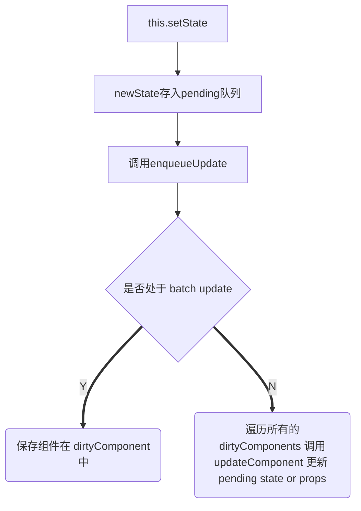
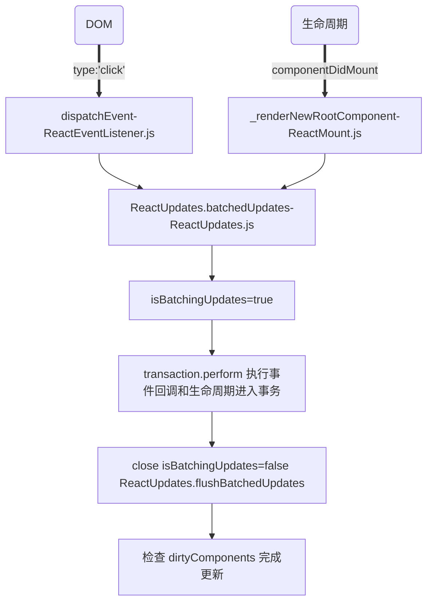

温故而知新，保持空杯心态

## React  基础

### 什么是 React?

是一个用于构建用户界面的 javaScript 库，主要用于构建 UI,很多人认为是 MVC 中的 View 层

特点：

- 声明式设计 -- 采用声明范式，可以轻松描述应用
- 高效 -- 通过对 DOM 的模拟，最大限度地减少与 DOM 的交互
- 灵活 --  React 可以与很多库或者框架很好地配合
- JSX -- JSX 是 javascript 语法的扩展
- 组件 -- 通过 React 构建的组件，使得代码更加容易得到，很好的应用在大项目的开发中
- 单向响应的数据流 -- 减少了重复代码

### React的渲染机制

#### React 渲染过程

页面打开的时候，React 会调用 render 函数来构建一颗 DOM 树，在 `state/props`改变的时候， render 函数会再次调用渲染出来另外一颗树，接着， React 会对两棵树进行对比，找出需要更新的地方进行批量改动

#### Diff 算法

**作用**

计算出 Virtual DOM 中真正变化的部分，并只针对该部分进行原生 DOM 操作，而非重新渲染整个页面。

**传统 diff 算法的劣处**

通过循环递归节点进行依次对比，算法复杂度达到 `O(n^3)`，n 是树的节点数。假设展示1000个节点，得执行上亿次比较。CPU 无法进行在很短的时间内计算出差异

**React 的 diff 算法**

将 Virtual DOM 树转换成为 Actual DOM 树的最少操作过程被称为调和。React  的 diff 算法就是调和的具体实现。

**React 的diff 策略**

React 用三大策略将 `O(n^3)`复杂都转换为 `O(n)`复杂度

策略1（tree diff）:

Web UI 中 DOM 节点跨层级的移动操作特别少，可以忽略不计

策略2（component diff）:

拥有相同类的两个组件生成相似的树形结构

拥有不同类的两个组件生成不同的树形结构

策略三（element diff）:

对于同一层级的一组子节点，通过唯一的 id 区分

**diff 策略详解**

*Tree diff*

1. React 通过 updateDepth 对 Virtual DOM 树进行层级控制
2. 对树分层比较，两棵树只对同一层次节点进行比较，如果该节点不存在时，则该节点以及其节点会被完全删除，不会再进行进一步比较
3. 只要遍历一次，就能完成整颗 DOM 的比较
4. 如果 DOM 出现了跨层操作，diff 只会简单考虑同层级的节点位置变化，如果是跨层的话，只有创建和删除节点的操作。因此也不建议进行跨 DOM 操作，可以通过 CSS 隐藏、显示节点，而不是真正地移除，添加 DOM 节点

```javascript
updateChildren:function(nextNestedChildrenElements,transaction,context){
    updateDepth++;
    var errorThrow = true;
    try{
        this._updateChildren(nextNestedChildrenElements,transaction,context)
    }finally{
        updateDepth--;
        if(updateDepth){
            if(errorThrow){
            	clearQueue();   
            }else{
                processQueue();
            }
        }
    }
}
```


*Component diff*

1. 同一类型的两个组件，按原策略（层级比较）继续比较 Virtual DOM 树即可
2. 同一类型的两个组件，组件 A 变化为 组件 B时，可能 Virtual DOM 没有任何改变，如果知道这一点，可节省大量计算时间。用户可以通过 `shouldComponentUpdate()` 来判断是否需要判断计算
3. 不同类型的组件，将一个（将被改变的）组件判断为 `dirty component(脏组件)`，从而替换整个组件的所有节点。

注意：如果组件 A 和 组件 B 的结构相似，但是 React 判断是不同类型的组件，则不会比较其结构，而是删除 组件 A 以及其子节点，创建组件 B 以其子节点。

*Element diff*

当节点处于同一层级时，diff 提供三个节点操作：删除、插入、移动

插入：组件 C 不在集合 （AB）中,需要插入

删除：组件 D 在集合 （ABD）中，但是集合变成（AB）,D就需要被删除

移动：组件 D 已经在集合（ABCD）中，且集合更新时，D 没有发生更新，只是位置的改变，如新的集合（ADBC）。D 在第二个，无须像传统的 diff,让旧集合的第二个 B 和新集合的比较，并且删除第二个位置的 B，再在第二个位置插入 D 。需要做的是（对同一层级的同组子节点）添加唯一的 key 进行区分，移动即可。

**移动逻辑详解**

情形一：新旧集合中存在相同节点但是位置不同时，如何移动节点


`lastIndex`有点像浮标，或者一个 map 的索引，默认值是 0，会与 map 中的元素进行比较后改变自己的值（取 `index`和 `lastIndex`中的较大值）

1. B，React 在新中取得 ,判断旧中是否存在相同的节点B,发现节点B后判断是否需要移动B。
   1. B 在旧中 `index = 1`,它 的 `lastIndex = 0`
   2. 不满足 `lastIndex > index`，无需移动操作。
   3. `lastindex = Math.max(lastindex,index) = 1` 
2. A，A在旧的 `index=0`,此时 `lastIndex=1`。满足 `lastIndex > index`，对 A 进行移动到 `lastIndex=1`。接着操作 `lastIndex=Math.max(lastIndex,index)`还是等于1
3. D，同 1，不移动，由于旧的D `index=3`,`lastIndex=1`，改 `lastIndex=Math.max(lastIndex,index)=3`
4. C,同 2，移动。C在旧的 `index=2`,满足`lastIndex(3)>index`，移动
5. 由于 C 已经是最后一个节点了，所以 diff 操作结束

情形二：新集合中有新加入的节点，旧集合中有删除的节点


1. B,同上理，不移动，更新 `lastIndex=1`
2. E,旧集合中没有，在 `lastIndex=1`上创建E，更新 `lastIndex=1`
3. C，C在旧集合中 `index=2`,不满足`lastIndex>index`，不移动，更新 `lastIndex=Math.max(lastIndex,index)=2`
4. A，旧集合中 `index=0`，符合 `lastIndex>index`，移动，`lastIndex还是等于 2`
5. 新旧集合对比后，再对旧集合遍历。判断新集合中没有，但是旧集合有的元素D，删除 D，diff 操作结束

**diff 的不足之处与待优化的地方**

情形三：将最后一个元素移动到最前面


D,此时D 不移动，但是因为它的 index 最大的，导致 `lastIndex=3`，从而使得其他元素的 `index < lastIndex`，导致都要去移动。

理想的情况是值移动D,不移动 ABC.因此在开发中，应该尽量减少将最后一个节点移动到列表的首部，当节点数量过大或者操作更新过于频繁的时候，会影响到 React 的渲染性能。

### React JSX

React 使用 JSX 来替代常规的 javascript,有几个优点：

- 执行更快，在编译为 javascript 代码后进行了优化
- 类型安全，在编译过程中就能发现错误
- 使用 JSX 编写模板简单快速

在 React 应用中，元素是构成 React 的最小单位，JSX 就是用来声明 React 当中的元素。

与浏览器的 DOM 元素不同，React 当中的元素是普通的对象，ReactDOM 可以确保浏览器的数据内容与 React 元素一致。通过 `ReactDOM.render`将元素渲染到 DOM 节点上。

```javascript
const App = <div className="foo " />
ReactDOM.render(<App>,document.getElementById('root'))
```

**原理**

如何用 JavaScript 元素来表示一个 DOM 元素的结构:

```html
<div class="box" id="content">
    <div class="title">
        Hello
    </div>
    <button>Click</button>
</div>
```

一个 DOM 元素包含的信息其实只有三个：标签、属性，子元素，所以上面的内容可以表示为

```json
{
    tag:'div',
    attrs:{className:'box',id:'content'},
    children:[{
        tag:'div',
        attrs{className:'title'},
        children:['Hello']
    },{
        tag:'button',
        attrs:null,
        children:['Click']
    }]
}
```

用 javaScript 有个缺点就是内容太长，结构不够清晰，用 HTML 的方式会方便很多。而 React 把 javascript 扩展了一下，让 javascript 能够支持直接在 javascript 代码中编写类似 HTML 标签结构的语法。编译的过程中会把类似 HTML 的 JSX 结构转换成为 javascript 的对象结构。例如下面的代码：

```jsx
import React,{Component} from 'react';
import ReactDOM from 'react-dom';
import '/index.css';

class MyComponent extends Component{
    render(){
        return(
            <div>
                <h1 className='title'>React JSX</h1>
            </div>
        )
    }
}
ReactDOM.render(
    <MyComponent />,
    document.getElememtById('root')
)
```

经过编译后：

```jsx
import React,{Component} from 'react';
import ReactDOM from 'react-dom';
import '/index.css';

class MyComponent extends Component{
    render(){
        return(
            React.createElement(
                'div',
                null,
                React.createElement(
                'h1',
                {className:'title'},
                "React JSX"
                )
            )
        )
    }
}
ReactDOM.render(
    React.createElement(MyComponent,null)
    document.getElememtById('root')
)
```

`React.createElement` 会构建一个 JavaScript 对象来描述 HTML 结构的信息，包括标签名，属性，还有子元素等等。

**所谓的JSX 其实就是 JavaScript 对象**

`React.render`功能就是把组件渲染并且构造 DOM 树，然后插入到页面上特定的元素上。

总结过程：

```shell
	Babel 编译 +   
	React.js 构造           ReactDOM.render
JSX -----> JavaScript 对象结构 -----> DOM 元素 -----> 插入页面
```

### React 生命周期函数

#### React v16.0 前的生命周期

分成四个阶段 Initialization、Mounting、Updation、Unmounting

#### **Initialization**

setup props and states

```jsx
import React,{Component} from 'react';
class Test extends Component{
    constructor(props){
        super(props)
    }
}
```

Test 类继承 react 的基本类，拥有了 render ，生命周期等等方法可以使用。

`super(props)`，用来调用基类的构造方法（constructor()），将父组件中的props 注入给子组件，供其读取。

使用ES6 classes构建组件的时候**static defaultProps={}**其实就是调用内部的**getDefaultProps**方法。

`constructor`可以做一些组件初始化的功能，例如初始化 `state`,就是调用内部的 `getIntialState`方法

#### **Mounting**

getDefaultProps => getInitialState => componentWillMount => render => componentDidMount

- componentWillMount

在组件挂载到 DOM 之前调用且只会被调用一次，这里调用 `setState`不会引起组件重新渲染，也可以把这边的内容写在 `constructor`中。另外 在 React SSR 中，这个生命周期函数很重要。React-Helmet等等插件都是根据这个函数来实现在 Server 插入内容

- render

根据组件的 `props`和 `state`，返回一个 React 元素，不负责组件的实际渲染工作，之后 React 根据元素去渲染 页面的 DOM 工作。render 是纯函数，不能在里面执行 `this.setState`，会有改变组件状态的副作用

- componentDidMount

组件挂载到 DOM 后调用，且只会被调用一次

#### **Updation**

props:

componentWillReciveProps => shouldComponentUpdate => ComponentWillUpdate => render => componentDidUpdate

states:

shouldComponentUpdate => componentWillUpdate => render => componentDidUpdate

**造成组件更新的情况有两类（三种）情况**

1.父组件重新 render

父组件重新 render 引起子组件重新 render 的情况有两种

a) 直接使用，每当父组件重新 render 导致 重传 `props`,子组件将跟着重新渲染，无论 `props` 知否有变化，可通过 `shouldComponentUpdate`方法优化

```jsx
class Child extends Component{
    shouldComponentUpdate(nextProps){ // 使用这个方法，可以避免无论 props 是否有更新都会导致组件跟着渲染
        if(nextProps.somethings === this.props.somethings){
            return false
        }
        render(){
            return <div>{this.props.sometings}</div>
        }
    }
}
```

b) 在 `componentWillReceiveProps`方法中，将 `props` 换成自己的 `state`

```jsx
class Child extends Component{
    constructor(props){
        super(props);
        this.state = {
            sometings:props.somethings
        }
    }
    componentWillReceiveProps(nextProps){
        // 父组件重传 props 时会调用这个方法
        this.setState({something:nextProps.somethings})
    }
    render(){
        return <div>{this.state.sometings}</div>
    }    
}
```

官网的描述，在 `componentWillReceiveProps`中调用 `this.setState()`不会引起第二次渲染

是因为 `componentWillReceiveProps`中判断 `props`是否变化了，如果变化了， `this.setState`将引起 `state`的变化，从而引起 `render`，此时就没有必要再做第二次重传 `props`引起的 `render`,避免重复做一样的渲染。

2.组件本身调用 `setState`，无论 `state` 是否有变化，可通过 `shouldComponentUpdate`方法优化

```jsx
class Child extends Component{
    constructor(props){
        super(props);
        this.state = {
            something:1
        }
    }
    shouldComponentUpdate(nextState){
        // 使用这个方法，可以避免相同 state引起 render
        if(nextState.something === this.state.something){
        	return false   
        }
    }
    handleClick = ()=>{
        const preSomething = this.state.something
        this.setState({something:preSomething})
    }
    render(){
        return <div onClick={this.handleChild}>{this.state.something}</div>
    }
}
```

- componentWillReceviceProps(nextProps)

这个方法只会调用于`props` 引起的组件更新过程中，参数 `nextProps`是父组件传给当前组件的新 `props`。但是父组件 `render`方法的调用不能保证重传给当前组件的 `props` 是否有变化，所以在此方法根据 `nextProps`和 `this.props`来查明重传的 `props`是否有变化，以及如果改变了要执行什么，例如根据新的 `props`调用 `this.setState()`触发当前组件重新 `render`

- shouldComponentUpdate(nextProps,nextState)

通过比较 `nextProps`，`nextState`以及 `this.state`,`this.props`返回 true 时当前组件将继续执行更新过程，返回 false 当前组件停止更新，从而来减少组件的不必要的渲染，优化组件性能。

- componentWillUpdate(nextProps,nextState)

在 调用 render 之前调用，在这里可以执行一些组件更新前的工作，一般比较少用

- componentDidUpdate(prevProps,prevState)

这个方法组件更新后调用，可以操作组件更新的 DOM,`prevProps`，`prevState`这两个参数是指组件更新前的 `props` 和 `state`

#### **Unmounting**

componentWillUnMount

- componentWillUnMount

这个方法在组件被卸载前调用，可以在这里执行一些清理工作。例如组件中使用的定时器，componentDidMount 中手动创建的 DOM 元素等等，可以避免内存泄露

具体实现可以看看这篇文章，[一次性搞懂 React 生命周期](https://segmentfault.com/a/1190000018499749)

#### React v.16.4 的生命周期

[图](http://projects.wojtekmaj.pl/react-lifecycle-methods-diagram/)


#### 变更缘故

生命周期在React v16 推出 Fiber 后就不合适了，如果开启 `async rendering`，在 `render`函数之前的所有函数，都有可能被执行多次。

v.16 前的生命周期中,`componentWillMount`,`componentReceiveProps`,  `shouldComponentUpdate`,`componentWillUpdate`是在 `render`之前执行的。

开发者如果开启了 `async rendering`，而且在上述的生命周期方法做 ajax 请求的话，那就将会被无谓多次调用。明显不是我们期望的结果。在 `componentWillMount`请求 ajax ,不管多快的结果都跟不上首次 `render`，而且 `componentWillMount`在服务器渲染也会被调用到，这样的 IO 操作放在 `componentDidMount`里面更加适合。

禁止不能用比劝导开发者不要这样用更好，所以除了 `shouldComponentUpdate`，其他在 `render`函数之前的所有函数 `componentWillMount`、`componentWillReceiveProps`，`componentWillUpdate`都被 `getDerivedStateFromProps`替代。

就是用一个静态函数 `getDerivedStateFromProps`来取代被 `deprecate`的几个生命周期函数，强制开发者在 `render`之前只做无副作用的操作，而且能做的操作局限在根据 `props`和 `state`决定新的 `state`

[官网API-getDerivedStateFromProps()](https://react.docschina.org/docs/react-component.html?no-cache=1#static-getderivedstatefromprops)

[关于更多](https://reactjs.org/blog/2018/06/07/you-probably-dont-need-derived-state.html)

v16.0 刚推出的时候，增加了一个 `componentDidCatch` 生命周期函数，新引入的两个生命周期函数:`getDerivedStateFromProps`和 `getSnapshotBeforeUpdate`

- getDerivedStateFromProps

`getDerivedStateFromProps`在v.16.3 中只是创建和更新（由父组件引发的）。如果不由父组件引发，这个方法是不会调用的，如自身的 `setState` 和 `forceUpate`引发的。

在 v.16.4  中改正了这一点，让 `getDerivedStateFromProps` 无论是 `Mounting` 还是 `Updating`,也无论是因为什么引起的 `Updating`全部都会被调用。

*static getDerivedStateFromProps(props,state)*在组件创建时和更新时的 `render`方法之前调用，它应该返回一个对象来更新状态，或者返回 null 来不更新任何内容

- getSnapshotBeforeUpadate

`getSnapshotBeforeUpdate`被调用于 `render` 之后，可以读取但是无法使用 DOM 的时候。它使得组件可以在可能更改之前从 DOM 中捕获一些信息（例如滚动位置）。这个生命周期返回的任何值都将作为参数传递给 `componentDidUpdate`

官网的例子：

```jsx
class ScrollingList extends React.Component{
    constructor(props){
        super(props);
        this.listRef = React.createRef();
    }
    getSnapshotBeforeUpdate(nextProps,prevState){
        // 我们是否要添加新的 items 到列表中，捕获滚动位置以便我们可以稍后整理滚动
        if(prevProps.list.length < this.props.list.length){
            const list = this.listRef.current;
            return list.scrollHeight - list.scrollTop
        }
        return null;
    }
    componentDidUpdate(prevProps,prevState,snapshot){
        // 如果我们有 snapshot 值，我们已经添加新的 items，调整滚动以至于这些新的 items，不会将就的 items 推出视图。
        if(snapshot){
            const list = this.listRef.current;
            list.scrollTop = list.scrollHeight - snapshot;
        }
    }
    render(){
        return(
            <div ref={this.listRef}>{/* ...contents */}</div>
        )
    }
}
```

另外可以看看这篇文章，[你可能不需要派生状态](https://www.imooc.com/article/39395)

### React Fiber

官方的解释:

**React Fiber 是对核心算法的一次重新实现**

#### **同步更新过程的局限**

v16 之前，更新过程是同步的，这可能会导致性能问题。

React 决定要加载或者更新组件树的时候，会做很多事情，比如调用各个组件的生命周期函数，计算和对比 Virtual DOM ,最后更新 DOM 树，这整个过程是同步进行的，也就是说只要一个加载或者更新过程开始，那么 React 就会一直更新下去，中途不会停歇。

表面看，这样的设计也是合理的，更新过程中不会有 I/O 操作，完全是 CPU 计算，所以不需异步操作。但是当组件书比较庞大的时候，问题就来了。

例如更新一个组件需要1毫秒，如果有200个组件需要更新，那就有200毫秒。用户在 input 按钮输入一个子，要等待200毫秒才会有反应，造成界面卡顿，带来不好的用户体验。

另外一个生动的比较就是潜水员的比喻，潜水员进行潜水任务，在潜到底的过程中，如果岸上有更加优先的任务他是不知道的，只有当他重新浮出水面才能去执行优先级更高的任务。

因为 javascript 单线程的特点，每个同步任务的耗时不能太长，不然就会让程序不会对其他输入做出反应，React 的更新就是犯了这个禁止，而 React Fiber 是要改变现状。

#### React Fiber

分片是破解 Javascript 同步操作时间过长的方法。

把一个耗时长的任务分成很多小片，每一个小片的运行时间都很短，虽然总时间依然很长，但是在每个小片执行之后，都给其他任务一个执行的机会，这样唯一的线程就不会被独占，其他任务依然有运行的时间。

React Fiber 把更新过程碎片化，每执行一段更新过程，就把控制权交还给 React 负责任务协调的模块，看看有没有其他紧急任务要做，如果没有就继续去更新，如果有紧急任务，那就去做紧急任务。

维护每一个分片的数据结构，就是 Fiber

#### 为什么叫 Fiber

在计算机科学中，Fiber 的含义是 “纤维”，意指比 Thread(线程) 更细的线，也就是比线程控制更精密的并发处理机制。

#### React Fiber 对现有代码的影响

在 React Fiber 中，一次更新过程会分成多个分片完成，所以完全可能一个更新任务还没有完成，会被另一个更高优先级的更新过程打断，这时候，**优先级的更新任务会优先处理完，而低优先级更新任务所做的工作则会完全作废，然后等待机会重头再来。**

因为一个更新过程可能会被打断，所以 React Fiber 更新过程会被分成两个阶段（Phase）：第一个阶段 Reconciliation 和 第二个阶段 Commit Phase.

在第一个阶段中，React Fiber 会找出需要更新哪些 DOM,这个阶段可以被打断，但是到了第二个阶段，那就是一鼓作气把 DOM 更新完成，不会被打断。

这两个阶段大部分工作是结合 React Fiber 和 生命周期函数。

以 `render` 为界，第一个阶段可能会调用下面这些生命周期函数：

- componentWillMount
- componentWillReceiveProps
- shouldComponentUpdate
- componentWillUpdate

下面这些生命周期函数则会在第二个阶段调用

- componentDidMount
- componentDidUpdate
- componentWillUnmount

因为第一个阶段会被打断，重新再来，会造成意想不到的情况。

比如说，一个低优先级的任务 A 正在执行，已经调用了某个组件的 `componentWillUpdate`函数，接下来发现自己的时间分片已经用完了，于是冒出水面，看看有没有紧急任务，发现有个紧急任务B，接下来 React Fiber 就去执行这个紧急任务B。任务A 虽然执行了一半，但是没有办法，只能完全放弃，等到任务B 完成后，任务 A 重头来一遍，也就是说 `componentWillUpdate`函数会被再重新调用一次。

在现有的 React 中，每个生命周期函数在一个加载或者更新过程中决定只会被调用一次，在 React Fiber 中，不再是这样了，第一阶段的声生命周期函数在一次加载和更新过程中可能会被多次调用。

使用 React Fiber 之后，一定要检查一下第一阶段相关的这些生命周期函数，看看有没有逻辑是假设在一个更新过程中只调用一次的，有的话就要改了。

看看可能会重复调用的函数

`componentWillReceiveProps`即使当前组件不更新，只要父组件更新也会引起和这个函数被调用多次，调用多次无妨

`shouldComponentUpdate`这个函数的作用是返回一个 true 或者 false，不应该有任何副作用，调用多次无妨

`render` 是纯函数，调用多次无妨

剩下 `componentWillMount` 和 `componentWillUpdate`这两个函数往往包含副作用，所以当使用 React Fiber 的时候一定要重点看这两个函数的实现。


### this.setState 异步原因以及更新机制

#### **现象**

在 React 中，如果是由 React 引发的事件处理（比如通过 onClick 引发的合成事件处理）和组件生命周期函数内（比如 `componentDidMount`），调用 `this.setState` 不会同步更新 `this.state`，除此之外的 `setState` 调用会同步执行 `this.state`。除此之外指的是绕过 React 通过 `addEventListener` 直接添加的事件处理函数，还有通过 `setTimeout`/`setInterval` 产生的异步调用。另外在合成事件和生命周期函数中的异步调用 `setState`（比如 `ajax` 和 `setTimeout`） 也是会同步更新 `this.setState`

#### 保证内部（数据）的统一

假设 setState 是同步的：

```javascript
console.log(this.state.value); //0
this.setState({value:this.state.value + 1})
console.log(this.state.value); //1
this.setState({value:this.state.value + 1})
console.log(this.state.value); //2
this.setState({value:this.state.value + 1})
```

这种只用到了 state 的情况下，同步 setState 是可以的。

然而这时需要将状态提升到父组件，以供多个兄弟组件共享：

```javascript
console.log(this.props.value) // 0
this.props.onIncrement();
console.log(this.props.value) // 0
this.props.onIncrement();
console.log(this.props.value) // 0
this.props.onIncrement();
```

在同步模型中，虽然 this.state 会立即更新，但是 this.props 并不会。而且在没有重渲染父组件的情况下，我们不能立即更新 this.props。如果要立即更新 this.props(立即重新渲染父组件)，必须放弃批处理（根据不同的情况，性能可能有显著下降）

所以为了解决这样的问题，在 React 中，this.state 和 this.props 都是异步更新的，在上面的例子中重构前后都会打印出0，这让状态提升更加安全。

#### 性能优化

我们通常认为状态更新会按照既定顺序被应用，无论 state 是同步更新还是异步更新，然而事实并不一定如此。

React 会依据不同的调用源，给不同的 setState 调用分配不同的优先级。调用源包括事件处理、网络请求、动画等。

#### 基本用法

```javascript
// 用法1
this.setState({},()=>{})
// 用法2
this.setState(()=({}),()=>{})

// 参数1：对象，key是 this.state 中key值，val 是修改后的值
// 参数2：函数，可查看数据是否更新完成，获取到数据更新后的最新 dom 结构
```

**不要直接修改 state**

```javascript
this.state.comment = 'Hello' (X)
```

**state  更新可能会异步**

从上面也知道了，React 为了性能优化，有可能会将多个 setState 调用合并为一次更新，因为 this.props 与 this.state  可能是异步更新的，你不可能依赖他们的值进行下一个 state 的计算

```javascript
this.setState({counter:this.state.counter + this.props.increment}) (X)
```

为了弥补这个问题，使用了另一种 setState 形式，接受一个函数。这个函数接收前一个状态作为第一个参数，应用更新时的 props 作为第二个参数，代码如下：

```javascript
this.setState((prevState,props)=>{
    counter:prevState.counter + props.increment
})
```

**多次setState函数调用产生的效果会合并**

当调用 setState ,React 会合并你提供的对象到当前的状态。所以当 state 是一个多键值的结构，可以单独更新其中一个，此时会 差分 更新，不会影响到其他的属性值

总结起来就是：

1. setState 不会立刻改变 React 组件中的 state
2. setState 通过触发一次组件的更新来引发重绘
3. 多次 setState 函数嗲用产生的效果会合并

重绘指的更新的生命周期函数：

- `shouldComponentUpdate`:被调用时 this.state 没有更新，如果返回 false，生命周期被中断，虽然不调用之后的函数，但是 state 仍然会被更新
- `componentWillUpdate`：被调用时 this.state 没有更新
- `render`：被调用时 this.state 得到更新
- `componentDidUpdate`

React会将setState的效果放在队列中，积攒着一次引发更新过程。为的就是把Virtual DOM和DOM树操作降到最小，用于提高性能。

**执行setState 后拿到最新的 state**

```javascript
updateData = (newData)=>{
    this.setState(
        {data:newData},
        () =>{
            console.log(this.state.data)
        } 
    )
}
```

#### setState 更新机制

**循环调用风险**

不要在 `shouldComponentUpdate`和 `componentWillUpdate`中调用 `setState`，不然会出现死循环

在调用 `setState`时候实际上会执行 `enqueueSetState`方法，并对 `partialState`、`pendingStateQueue`更新队列进行合并操作，最终通过 `enqueueUpdate`执行 state 更新。

而 `performUpdateIfNecessary`方法会获取 `pendingElement`、`pendingStateQueue`、`pendingForceUpdate`并调用 `receiveComponent`和 `updateComponent`方法进行组件更新

如果在 `componentWillUpdate` 和 `shouldComponentUpdate` 中调用 `setState`，此时 `pendingStateQueue !== null`则 `performUpdateIfNessary` 会调用 `updateComponent` 进行组件更新，而 `updateComponent`又会调用 `shouldComponentUpdate` 和 `componentWillUpdate`这样就导致了循环调用

setState 源码：

```javascript
// React 组件继承自 React.Component，而 SetState 是 React.Component 的方法，对于组件来说，setState 属于其原型方法
// 在 React 中每个组件都拥有一个 this.updater，是用来驱动 state 更新的工具对象。当我们在构造函数中调用 super 的时实质调用的就是函数 ReactComponent
function ReactComponent(props,context,updater){
    this.props = props;
    this.context = context;
    this.refs = emptyObject;
    // ReactNoopUpdateQueue 实际是没有什么意义的，只相当于是一个初始化的过程。而 ReactNoopUpdateQueue.enqueueSetState 主要起到一个在非生产版本中警告的作用。真正的 updater 是在 renderer 中注入（inject）。因此如果在 constructor 尝试调用 this.helper.isMount会返回 false，表示并没有安装（mount），如果你调用 setState，也会给出响应的警告
    this.updater = updater || ReactNoopUpdateQueue;
}
ReactComponent.prototype.setState = function(partialState,callback){
    // 调用 enqueueSetState 将 setState 事务放进队列中
    // partialState 可以传 Object,也可以传 function,会产生新的 state 以一种 Object.assign() 的方式跟旧的 state 进行合并
    // 参数 this 是组件的实例
    this.updater.enqueueSetState(this,partialState);
    if(callback){
        this.updater.enqueueCallback(this,callback,'setState')
    }
}

var ReactUpdateQueue = {
    // 实际通过 enqueueSetState 执行
    // 1.将新的 state 放进数组
    // 2.用 enqueueUpdate 来处理将要更新的实例对象
    enqueueSetState：function(publicInstance,partialState){
        // 获取当前组件的 instance，里面有很多属性，主要关注 pendingState(待更新队列)，pendingCallbacks(更新回调队列)
        const internalInstance = getInernalInstanceReadyForUpdate(
            publickInstance,
            'setState'
        )
        if(!inernalInstance) return
        // 更新队列合并操作
        const queue = internalInstance._pendingStateQueue || （internalInstance._pendingStateQueue = []）
        // partialState 可以理解为之前的 state
        queue.push(partialState)
        // 最终通过 enqueueUpdate 更新，将新的 component instance 放入一个队列
        enqueueUpdate(internalInstance)
    }
    // 如果存在 _pendingElement、_pendingStateQueue 和 _pendingForceUpdate 则更新组件
    performUpdateIfNessary:function(transaction){
        if(this._pendingElement != null){        ReactReconciler.receiveComponent(this,this._pendingElement,transaction,this._context)
        }
        if(this._pendingStateQueue !== null || this._pendingForceUpdate){        this.updateComponent(transaction,this._currentElement,this._currentElement,this._context)
        }
    } 
}


```


**setState 调用栈**



React的setState函数实现中，会根据一个变量 `isBatchingUpdates` 判断是 直接更新 this.state还是 放到队列 中。

`isBatchingUpdates`默认`false`，表示setState会同步更新this.state，但是函数`batchedUpdates`函数会把`isBatchingUpdates`修改为`true`。当React在调用事件处理函数之前就会调用`batchedUpdates`，造成的后果，就是由React控制的事件处理过程setState不会同步更新this.state。

```javascript
function enqueueUpdate(internalInstance){
    ReactUpdates.enqueueUpdate(internalInstance)
}
const ReactUpdates = {
    enqueueUpdate:function enqueueUpdate(component){
        // 保证 ReactUpdates.ReactReconcileTransaction 与 batchingStrategy 是存在的，否则给出对应的警告
        ensureInjected();
        // 如果不处于批量更新模式
        if(!batchingStrategy.isBatchingUpdates){
            // 调用事务
            batchingStrategy.batchedUpdates(enqueueUpdate,component)
            return
        }
        // 如果处于批量更新模式,将组件放入脏组件队列，也就是待更新组件队列
        dirtyComponents.psuh(component);
    }
}

// batchingStrategy。实质上是一种批量更新策略
const ReactDefaultBatchingStrategy = {
    isBatchingupdates:false,
    batchedUpdates:function(callback,a,b,c,d,e){
        const alreadyBatchingUpdates = ReactDefaultBatchingStrategy.isBatchingUpdates
        ReactDefaultBatchingStrategy.isBatchingUpdates = true
        if(callback){
            callback(a,b,c,d,e)
        }else{
            transaction.perform(callback,null,a,b,c,d,e)
        }
    }
}
```

**Transaction**

关于 React 中的事务 Transaction,源码中有这样的 ASCII图

```
/**
 * <pre>
 *                       wrappers (injected at creation time)
 *                                      +        +
 *                                      |        |
 *                    +-----------------|--------|--------------+
 *                    |                 v        |              |
 *                    |      +---------------+   |              |
 *                    |   +--|    wrapper1   |---|----+         |
 *                    |   |  +---------------+   v    |         |
 *                    |   |          +-------------+  |         |
 *                    |   |     +----|   wrapper2  |--------+   |
 *                    |   |     |    +-------------+  |     |   |
 *                    |   |     |                     |     |   |
 *                    |   v     v                     v     v   | wrapper
 *                    | +---+ +---+   +---------+   +---+ +---+ | invariants
 * perform(anyMethod) | |   | |   |   |         |   |   | |   | | maintained
 * +----------------->|-|---|-|---|-->|anyMethod|---|---|-|---|-|-------->
 *                    | |   | |   |   |         |   |   | |   | |
 *                    | |   | |   |   |         |   |   | |   | |
 *                    | |   | |   |   |         |   |   | |   | |
 *                    | +---+ +---+   +---------+   +---+ +---+ |
 *                    |  initialize                    close    |
 *                    +-----------------------------------------+
 * </pre>
 */
```

React 中的事务 Transaction，会给方法包装一个个 wrapper，其中每个 wrapper 都有两个方法：initialize 与 close。当执行方法时，需要执行事务的 perform 方法。这个方法会首先一次执行 wrapper 的 initialize,然后执行函数本身，最后执行 wrapper 的 close 方法

定义 Transaction 需要给构造函数混入 Transaction.Mixin，并需要提供一个原型方法 getTransactionWrappers 用于返回 wrapper 数组。

```javascript
var RESET_BATCHED_UPDATES = {
    initialize:emptyFuntion,
    colse:function(){
        // 重置为 false
        ReactDefaultBatchingStrategy.isBatchingUpdates = false;
    }
}
var FLUSH_BATCHED_UPPDATES = {
    initialize:emptyFunction,
    close:ReactUpdates.flushBatchedUpdates.bind(ReactUpdates)
}
var TRANSACTION_WRAPPERS = [FLUSH_BATCHED_UPDATES,RESET_BATCHED_UPDATES]；
function ReactDefaultBatchingStrategyTransaction(){
    this.reinitializeTransaction();
}
Object.assign(
    ReactDefaultBatchingStrategyTransaction.prototype,
    Transaction.Mixin,{
        getTransactionWrappers:function(){
            return TRANSACTION_WRAPPERS;
        }
    }
)
var transaction = new ReactDefaultBatchingStrategyTransaction();
```

重新回顾一下更新的过程，如果处于批量更新的过程中（`isBatchingUpdates`为 true）的时候，则直接将组件传入 `dirtyComponents`。如果不是的话，就开启批量更新，用事务 `transaction.perform`执行 `enqueueUpdate`，这时候 `isBatchingUpdates`经过上次执行已经是 true，将直接传入 `dirtyComponents`。那么更新的组件传入 `dirtyComponent`会发生什么？

`batchUpdates`是处于一个事务中的，该事务在 close 阶段做了两件事，首先是将 `ReactDefaultBatchingStrategy.isBatchingUpdates`设置为 false，即关闭批量更新的标志位，第二个就是调用方法 `ReactUpdates.flushBatchedUpdates`。

```javascript
// 代码有省略
var flushBatchedUpdates = function(){
    while(dirtyComponents.length){
        if(dirtyComponents.length){
            var transaction = ReactUpdatesFlushTransaction.getPooled();
            // 以事务的方式执行了 runBatchedUpdates             
            transaction.perform(runBatchedUpdates,null,transaction);
            ReactUpdatesFlushTransaction.release(transaction)
        }
    }
}

function runBatchedUpdates(transaction){
    var len = transactiono.dirtyComponentsLength;
    // 将组件中的 mountOrder 进行了递增排序，目的就是保证更新顺序，父组件保证其子组件之前更新。
    dirtyComponents.sort(mountOrderComparator);
    for(var i=0;i<len;i++){
        // 在组件中获得 setState 完成之后的回调函数
        var component = dirtyComponents[i];
        var callbacks = component._pendingCallbacks;
        component._pendingCallbacks = null;
        // ...
        ReactReconciler.performUpdateIfNessary(component,transaction.reconcileTransaction)
        // ...
        if(callbacks){
            for(var j=0;j<callbacks.length;j++){
                transaction.callbackQueue.enqueue(
                callbacks[j],
                component.getPublickInstance()
                )
            }
        }
    }
}
// performUpdateIfNessary 执行组件实例的原型方法performUpdateIfNecessary
performUpdateIfNessary:function(internalInstance,transaction){
    interbalInstance.performUpdateIfNecessary(transaction)
}
// 省略版本
var ReactCompositeComponentMixin = {
    performUpdateIfNecessary:function(transaction){
        if(this._pendingStateQueue !==null || this._pendingForceUpdate){
            this.updateComponent(
                transaction,
                this._currentElement,
                this._currentElement,
                this._context,
                this._context
            )
        }
    }
}

updateComponent: function(
    transaction,
    prevParentElement,
    nextParentElement,
    prevUnmaskedContext,
    nextUnmaskedContext
  ) {
    var inst = this._instance;
    var willReceive = false;
    var nextContext;
    var nextProps;

    // 验证组件context是否改变
    // ......

    // 验证是否是props更新还是组件state更新
    if (prevParentElement === nextParentElement) {
      nextProps = nextParentElement.props;
    } else {
      //存在props的更新  
      nextProps = this._processProps(nextParentElement.props);
      willReceive = true;
    }
    //根据条件判断是否调用钩子函数componentWillReceiveProps
    if (willReceive && inst.componentWillReceiveProps) {
      inst.componentWillReceiveProps(nextProps, nextContext);
    }
    //计算新的state
    var nextState = this._processPendingState(nextProps, nextContext);

    var shouldUpdate =
      this._pendingForceUpdate ||
      !inst.shouldComponentUpdate ||
      inst.shouldComponentUpdate(nextProps, nextState, nextContext);

    if (shouldUpdate) {
      this._pendingForceUpdate = false;
      this._performComponentUpdate(
        nextParentElement,
        nextProps,
        nextState,
        nextContext,
        transaction,
        nextUnmaskedContext
      );
    } else {
      this._currentElement = nextParentElement;
      this._context = nextUnmaskedContext;
      inst.props = nextProps;
      inst.state = nextState;
      inst.context = nextContext;
    }
  }
// 计算新的 state 里面调用了 _processPending
{
  _processPendingState: function(props, context) {
    var inst = this._instance;
    var queue = this._pendingStateQueue;
    var replace = this._pendingReplaceState;
    this._pendingReplaceState = false;
    this._pendingStateQueue = null;

    if (!queue) {
      return inst.state;
    }

    if (replace && queue.length === 1) {
      return queue[0];
    }

    var nextState = Object.assign({}, replace ? queue[0] : inst.state);
    for (var i = replace ? 1 : 0; i < queue.length; i++) {
      var partial = queue[i];
      Object.assign(
        nextState,
        typeof partial === 'function' ?
          partial.call(inst, nextState, props, context) :
          partial
      );
    }

    return nextState;
  }
}
```

这一部分代码相对来说不算是很难，`replace`是存在是由于之前被废弃的API`this.replaceState`，我们现在不需要关心这一部分，现在我们可以知道为什么给 `setState` 传入的参数是函数时，就可以解决 `setState` 的潜在问题。

```javascript
this.setState({value:this.state.value + 1})
this.setState({value:this.state.value + 1})
```

调用 `setState`是批量更新，那么在第一次调用之后，this.state.value的值并没有发生拜年话。两次更新的指都是一样的。如果传递的是会调用函数形式，那么 `partial.call(inst,nextState,props,context)`接受的 state 都是上一轮更新之后的新值，因此可以达到我们想要的结果。

`_processPendingState` 在计算完新的 state 之后会执行 `_performComponentUpdate`

```javascript
function _performComponentUpdate(
    nextElement,
    nextProps,
    nextState,
    nextContext,
    transaction,
    unmaskedContext
  ) {
    var inst = this._instance;

    var hasComponentDidUpdate = Boolean(inst.componentDidUpdate);
    var prevProps;
    var prevState;
    var prevContext;
    if (hasComponentDidUpdate) {
      prevProps = inst.props;
      prevState = inst.state;
      prevContext = inst.context;
    }
	//  在更新之前，调用钩子函数 componentWillUpdate，然后更新了属性（props,state,context）
    if (inst.componentWillUpdate) {
      inst.componentWillUpdate(nextProps, nextState, nextContext);
    }

    this._currentElement = nextElement;
    this._context = unmaskedContext;
    inst.props = nextProps;
    inst.state = nextState;
    inst.context = nextContext;
	// 执行函数_updateRenderedComponent，涉及到 render 调用和相应的 DOM 更新
    this._updateRenderedComponent(transaction, unmaskedContext);
	// 最后执行 componentDidUpdate
    if (hasComponentDidUpdate) {
      transaction.getReactMountReady().enqueue(
        inst.componentDidUpdate.bind(inst, prevProps, prevState, prevContext),
        inst
      );
    }
}
```

到目前为止，我们已经基本介绍完了setState的更新过程，只剩一个部分没有介绍，那就是setState执行结束之后的回调函数。我们知道，setState函数中如果存在callback，则会有:
　　

```javascript
  if (callback) {
    this.updater.enqueueCallback(this, callback);
  }
```

　　call函数会被传递给`this.updater`的函数`enqueueCallback`，然后非常类似于setState，`callback`会存储在组件内部实例中的`_pendingCallbacks`属性之中。我们知道，回调函数必须要setState真正完成之后才会调用，那么在代码中是怎么实现的。大家还记得在函数`flushBatchedUpdates`中有一个事务`ReactUpdatesFlushTransaction`:
　　

```javascript
//代码有省略
var flushBatchedUpdates = function() {
  while (dirtyComponents.length) {
    if (dirtyComponents.length) {
      //从事务pool中获得事务实例
      var transaction = ReactUpdatesFlushTransaction.getPooled();
      transaction.perform(runBatchedUpdates, null, transaction);
      //释放实例
      ReactUpdatesFlushTransaction.release(transaction);
    }
    //......
  }
};
```

　　我们现在看看`ReactUpdatesFlushTransaction`的wrapper是怎么定义的:

```javascript
var UPDATE_QUEUEING = {
  initialize: function() {
    this.callbackQueue.reset();
  },
  close: function() {
    this.callbackQueue.notifyAll();
  },
};
```

　　我们看到在事务的`close`阶段定义了`this.callbackQueue.notifyAll()`,即执行了回调函数，通过这种方法就能保证回调函数一定是在setState真正完成之后才执行的。

现在可以回答，为什么下面这两种改代码会产生不同的情况：

```javascript
//未按预期执行
_addValue() {
    this.setState({
        value: this.state.value + 1
    })
    this.setState({
        value: this.state.value + 1
    })
}
//按预期执行
_addValue() {
    setTimeout(()=>{
        this.setState({
            value: this.state.value + 1
        });
        this.setState({
            value: this.state.value + 1
        });
    },0)
}
```

在第一种情况下，如果打断点追踪你会发现，在第一次执行`setState`前，已经触发了一个 `batchedUpdates`，等到执行setState时已经处于一个较大的事务，因此两个setState都是会被批量更新的(相当于异步更新的过程，this.state.value值并没有立即改变)，执行setState只不过是将两者的`partialState`传入`dirtyComponents`，最后再通过事务的`close`阶段的`flushBatchedUpdates`方法去执行重新渲染。但是通过`setTimeout`函数的包装，两次setState都会在click触发的批量更新`batchedUpdates`结束之后执行，这两次setState会触发**两次**批量更新batchedUpdates，当然也会执行两个事务以及函数`flushBatchedUpdates`,这就相当于一个同步更新的过程，自然可以达到我们的目的，这也就解释了为什么React文档中既没有说setState是同步更新或者是异步更新，只是模糊地说到，setState并不保证同步更新。

#### DOM事件和生命周期




### React合成事件

### HOC 的应用

### 

### 中间件应用 

### Redux 的应用和原理 

### Mobx 的应用和原理


### 参考链接：

1. [React 渲染机制解析](https://segmentfault.com/a/1190000010522782)
2. [React之diff算法](https://www.jianshu.com/p/3ba0822018cf)
3. [React JSX](https://www.runoob.com/react/react-jsx.html)
4. [使用 JSX 描述 UI 信息](http://huziketang.mangojuice.top/books/react/lesson6)
5. [React Fiber 是什么？](https://zhuanlan.zhihu.com/p/26027085)
6. [为什么setState是异步的](https://www.jianshu.com/p/cc12e9a8052c)
7. [React 中 setState() 为什么是异步的？](https://www.imooc.com/article/23912?block_id=tuijian_wz)
8. [this.setState使用时的一些坑](https://www.cnblogs.com/t-sun-j/p/10300825.html)
9. [React setState 简单整理总结](https://segmentfault.com/a/1190000015463599)
10. [日常抄书之一次性弄懂setState](https://segmentfault.com/a/1190000018615027)
11. [一次性搞懂解React生命周期](https://segmentfault.com/a/1190000018499749)
12. [React技术内幕:setState的秘密](https://segmentfault.com/a/1190000010785692)
13. [浅入深出setState（下篇）](https://segmentfault.com/a/1190000015821018)

